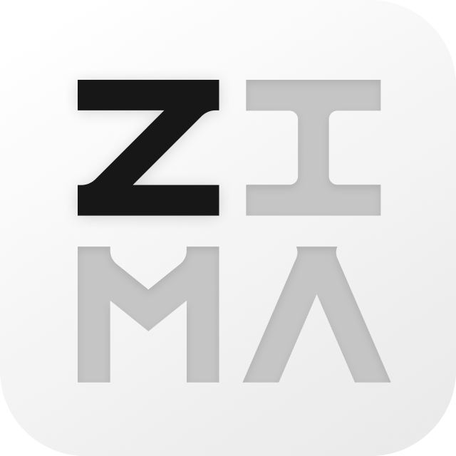

# ZimaOS Echo

  

  <a href="../../README.md">English</a> |
  <a href="../zh_CN/README.md">简体中文</a> |
  <a href="../zh_TW/README.md">繁體中文</a> |
  <a href="../ja_JP/README.md">日本語</a> |
  <a href="../ko_KR/README.md">한국어</a> |
  <a href="../de_DE/README.md">Deutsch</a> |
  <a href="../fr_FR/README.md">Français</a> |
  <a href="../es_ES/README.md">Español</a> |
  <a href="../it_IT/README.md">Italiano</a> |
  <a href="../pt_BR/README.md">Português</a> |
  <a href="../ru_RU/README.md">Русский</a> |
  <a href="../ar_SA/README.md">العربية</a> |
  <a href="../hi_IN/README.md">हिन्दी</a> |
  <a href="../th_TH/README.md">ไทย</a> |
  <a href="../vi_VN/README.md">Tiếng Việt</a> |
  <a href="../id_ID/README.md">Bahasa Indonesia</a> |
  <a href="../tr_TR/README.md">Türkçe</a> |
  <a href="../pl_PL/README.md">Polski</a> |
  <a href="../nl_NL/README.md">Nederlands</a> |
  <a href="../sv_SE/README.md">Svenska</a>

  
  
  

> Η ελληνική μετάφραση είναι ανολοκλήρωτη.
>
> Πλήρες περιεχόμενο: [README (English)](../../README.md)
