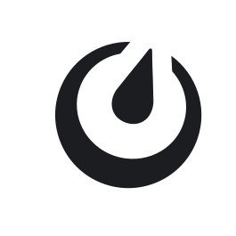
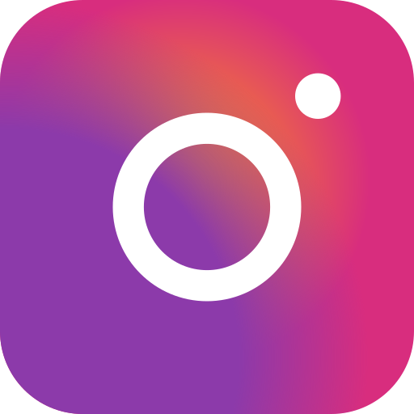
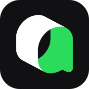

<p align="center">
  <a href="../../README.md">English</a> |
  <a href="../ca_ES/README.md">Català</a> |
  <a href="../cs_CZ/README.md">Čeština</a> |
  <a href="../da_DK/README.md">Dansk</a> |
  <a href="../de_DE/README.md">Deutsch</a> |
  <a href="../el_GR/README.md">Ελληνικά</a> |
  <a href="../en_GB/README.md">English (UK)</a> |
  <a href="../es_ES/README.md">Español</a> |
  <strong>Français</strong> |
  <a href="../ga_IE/README.md">Gaeilge</a> |
  <a href="../hr_HR/README.md">Hrvatski</a> |
  <a href="../hu_HU/README.md">Magyar</a> |
  <a href="../it_IT/README.md">Italiano</a> |
  <a href="../ja_JP/README.md">日本語</a> |
  <a href="../ko_KR/README.md">한국어</a> |
  <a href="../ml_IN/README.md">മലയാളം</a> |
  <a href="../nb_NO/README.md">Norsk Bokmål</a> |
  <a href="../nl_NL/README.md">Nederlands</a> |
  <a href="../pl_PL/README.md">Polski</a> |
  <a href="../pt_BR/README.md">Português (BR)</a> |
  <a href="../pt_PT/README.md">Português (PT)</a> |
  <a href="../ro_RO/README.md">Română</a> |
  <a href="../ru_RU/README.md">Русский</a> |
  <a href="../sk_SK/README.md">Slovenčina</a> |
  <a href="../sv_SE/README.md">Svenska</a> |
  <a href="../zh_CN/README.md">简体中文</a> |
  <a href="../zh_TW/README.md">繁體中文</a>
</p>

<p align="center">
  <a href="https://github.com/IceWhaleTech/ZimaOS-Blue/actions"></a>
  <a href="https://github.com/IceWhaleTech/ZimaOS-Blue/releases"></a>
  <a href="../../LICENSE"></a>
</p>

<p align="center">
  <a href="https://discord.gg/SrCYvumF"></a>&nbsp;&nbsp;
  <a href="https://www.facebook.com/zimaboard/"></a>&nbsp;&nbsp;
  <a href="https://x.com/ZimaSpace"></a>&nbsp;&nbsp;
  
</p>

## Introduction

Inspiré par Clawdbot, nous croyons que le **futur** de l'informatique personnelle sera **façonné par des agents IA diversifiés, locaux d'abord**, fonctionnant en périphérie.

**ZimaOS Blue est notre réponse** — un **environnement d'exécution et une boîte à outils pour agents, entièrement open source, auditable et prêt pour la production**, qui vous permet de déployer des agents privés et auto-hébergés sans aucune friction.

Conçu pour les développeurs audacieux qui veulent **créer leurs propres agents par intuition ou artisanalement**, Blue est **optimisé pour la performance** : écrit en **Go**, avec une empreinte mémoire aussi basse que 10 Mo. Il fonctionne sur **tout x86, Raspberry Pi, Windows, macOS** — partout où vous branchez l'alimentation.


## Points forts

### Conception locale d'abord et accès automatique aux modèles

Allez plus loin : il offre un support natif pour **plus de 20 plateformes de messagerie instantanée**, des interfaces **pilotées par la voix** pour un dialogue naturel et contextuel, un **changement de modèle sans configuration** avec détection IDE, et des personnalités à couches SOUL.

<p align="center">
  &nbsp;&nbsp;
  &nbsp;&nbsp;
  &nbsp;&nbsp;
  &nbsp;&nbsp;
  &nbsp;&nbsp;
  &nbsp;&nbsp;
  &nbsp;&nbsp;
  &nbsp;&nbsp;
  &nbsp;&nbsp;
  &nbsp;&nbsp;
  &nbsp;&nbsp;
  &nbsp;&nbsp;
  &nbsp;&nbsp;
  &nbsp;&nbsp;
  &nbsp;&nbsp;
  &nbsp;&nbsp;
  &nbsp;&nbsp;
  &nbsp;&nbsp;
  &nbsp;&nbsp;
  
</p>

### Rapide et léger

Compilé nativement en Go — pas d'interpréteur, pas de VM, pas de surcharge. Fonctionne silencieusement sur tout, des serveurs à vos appareils de bureau.

| Métrique | ZimaOS Blue (Go) | OpenClaw (Node + dist) |
|--------|-------------------|------------------------|
| `--help` démarrage à froid / à chaud | **0.18 s / < 0.01 s** | 3.31 s / ~1.11 s |
| `status` exécution (meilleur sur 3) | **< 0.01 s** | 5.98 s |
| `--help` RSS max | **~10 Mo** | ~394 Mo |
| `status` RSS max | **~15 Mo** | ~1.52 Go |
| Dépendances d'exécution | **Aucune** | Node.js 18+ |

> Benchmark réalisé sur macOS arm64 (mode serveur, sans interface de bureau), même machine, meilleur sur 3 exécutions. Fév. 2026.

### Go pur, tout appareil

100% Go, binaire statique. **Compilation croisée vers 5 cibles** prêtes à l'emploi ( amd64/arm64,  amd64/arm64,  amd64). Pas de runtime Node, pas de Python, pas de conteneurs requis. Déposez-le sur un NAS, un Raspberry Pi, un vieux routeur x86 ou un Mac — ça fonctionne tout simplement. **Puis ajoutez votre propre interface, logique et compétences d'agent** — un seul code source, toutes les plateformes.

### Sécurité et gouvernance

Proxy API sidecar intégré avec défense en profondeur :
- **Exécution en bac à sable** – Tous les appels d'outils s'exécutent dans des environnements isolés.
- **Défense contre l'injection de prompts** – Plus de 7 stratégies d'interception intégrées.
- **Audit de session** – Surveillance complète des sessions, chaque interaction est traçable.
- **RBAC et WebAuthn** – Contrôle d'accès granulaire avec authentification sans mot de passe.

## Pourquoi Blue

Nous croyons que **l'informatique personnelle de nouvelle génération** adopte les LLM — mais des agents **contrôlables et auditables** restent le socle pour les individus comme pour les équipes. **Blue offre** :
- **Noyau complet** – Gestion avancée des modèles, intégration de messagerie instantanée, personnalité enrichie et interfaces en langage naturel adaptées aux interactions quotidiennes (casques, voix, lunettes connectées).
- **Local d'abord, ultra-léger, multi-appareils** – Pas besoin de matériel haut de gamme. Fonctionne sur tout ce qui peut calculer.
- **Sécurisé et auditable** – Audit de session, bac à sable, contrôles de permissions et un proxy API intégré qui agit comme un pare-feu applicatif — chaque octet entrant/sortant est visible.


Nous minimisons le code répétitif pour que vous puissiez **vous concentrer sur l'essentiel**. Fidèle à la **philosophie de conception de ZimaOS**, Blue offre :
- **Du zéro au fonctionnel en un clic** – Déploiement instantané, pas de configuration complexe.
- **Prototypage rapide** – Créez par intuition ou artisanalement des outils, interactions et packages applicatifs spécifiques à vos scénarios.
- **Prêt pour le monde entier** – **Le monde est vaste**, et il ne parle pas anglais par défaut. **Plus de 20 langues, nativement**, sans barrières.
- **Écosystème de modèles ouvert** – Pas de dépendance à un fournisseur. Apportez vos propres modèles.

<details>
<summary>
<p align="center">
  &nbsp;&nbsp;
  &nbsp;&nbsp;
  &nbsp;&nbsp;
  &nbsp;&nbsp;
  &nbsp;&nbsp;
  &nbsp;&nbsp;
  &nbsp;&nbsp;
  &nbsp;&nbsp;
  &nbsp;&nbsp;
  &nbsp;&nbsp;
  &nbsp;&nbsp;
  &nbsp;&nbsp;
  &nbsp;&nbsp;
  &nbsp;&nbsp;
  &nbsp;&nbsp;
  &nbsp;&nbsp;
  
</p>
</summary>

| Fournisseur | Modèles | Type |
|-------------|---------|------|
| OpenAI | GPT-4o, GPT-4, o1, o3 | Cloud |
| Anthropic | Claude 4.5, Claude 4 | Cloud |
| Google | Gemini 2.5, Gemini 2.0 | Cloud |
| Ollama | Llama, Qwen, Gemma, Phi, etc. | Local |
| DeepSeek | DeepSeek-V3, DeepSeek-R1 | Cloud |
| Grok | Grok-3, Grok-3-mini | Cloud |
| Qwen | Qwen-Max, Qwen-Plus, Qwen-Turbo | Cloud |
| GLM | GLM-4, GLM-4-Flash | Cloud |
| Moonshot | Moonshot-v1 | Cloud |
| MiniMax | abab6.5, abab5.5 | Cloud |
| Venice | Llama, Mistral (vie privée d'abord) | Cloud |
| AWS Bedrock | Claude, Llama, Titan | Cloud |
| Azure | Modèles OpenAI via Azure | Cloud |
| OpenRouter | 100+ modèles agrégés | Cloud |
| AIHubMix | Agrégateur multi-fournisseurs | Cloud |
| Codex | OpenAI Codex | Cloud |
| Personnalisé | Toute API compatible OpenAI / Anthropic / Gemini | Cloud / Local |

</details>

### IDE supportés

<p align="center">
  &nbsp;&nbsp;
  &nbsp;&nbsp;
  &nbsp;&nbsp;
  &nbsp;&nbsp;
  &nbsp;&nbsp;
  &nbsp;&nbsp;
  &nbsp;&nbsp;
  
</p>

## Démarrage rapide

### Option 1 : Télécharger l'application de bureau (macOS et Windows)

Obtenez l'application native — pas de dépendances, pas de compilation. Configuration d'essai intégrée, prise en main en quelques secondes — commencez à discuter immédiatement via connexion distante, sans configurer de bot. Prêt à l'emploi.

- **macOS** : [Télécharger le DMG](https://github.com/IceWhaleTech/ZimaOS-Blue/releases/latest)
- **Windows** : [Télécharger l'installateur](https://github.com/IceWhaleTech/ZimaOS-Blue/releases/latest)

### Option 2 : Script d'installation

**macOS / Linux**
```bash
curl -fsSL https://ota.zimaos.com/blue | sh
```

**Windows (PowerShell)**
```powershell
irm https://ota.zimaos.com/blue/windows | iex
```

### Option 3 : Compiler depuis les sources

```bash
git clone https://github.com/IceWhaleTech/ZimaOS-Blue.git
cd ZimaOS-Blue
```

**macOS / Linux**
```bash
sh dev.sh
```

**Windows (PowerShell)**
```powershell
.\dev.bat
```

## Vue d'ensemble de l'architecture

<details>
<summary>

</summary>

### Carte des packages (`server/internal/`)

| Couche | Packages |
|-------|----------|
| Passerelle | bootstrap, server, gateway |
| Proxy | proxy, connection, streaming, resilience |
| Fournisseur | providerpool, providers, llm |
| Élagage | pruner (detector, segmenter, bm25, pipeline, cache) |
| Agent | context, tools, personality, humanizer |
| Mémoire | memory, embedding, kvstore |
| Canal | channel, autoreply, i18n |
| Sécurité | security, auth, permission, rbac, mfa, password, oidc, extauth, sandbox, promptguard, audit |
| Voix | voice, tts, stt, speech |
| Observation | metrics, heartbeat, companion, profiling, leakdetect |
| Extension | plugin, skill, skillstore |
| Intégration | browser, homeassistant, cron, workflow, formfiller, tunnel, crawler |
| Ordonnanceur | scheduler, worker, workerpool, pool |
| Noyau | lifecycle, config, logger, database, cache, ratelimit, retry, timeutil, sync |
| Système | sysinfo, cgroup, iotask, watcher, resources, backup, update |
| Multi-locataire | tenant, user, session, preview |

</details>

### Flux de données

**Requête de chat (chemin chaud du proxy)**
```
Client [Clé API Proxy] → Porte d'authentification → Garde de prompts → Élagage de contexte (optionnel)
  → Pool de fournisseurs (route:auto/cloud/local) → CC Cache (L1→L2) vérification
  → LLM en amont → Réponse → Stockage en cache → Écriture des métriques → Client (flux SSE)
```

**Flux de messages des canaux**
```
Telegram/Discord/... → Gestionnaire de canaux → Vérification AutoReply
  → (pas de correspondance) → Gestionnaire de chat → LLM → Humaniseur (MD→texte) → Canal → Utilisateur
```

**Pipeline vocal**
```
Audio WebSocket → STT (Whisper) → Traitement LLM → TTS (eSpeak/Edge) → Audio WebSocket
```

## Comment utiliser


## Jalons

<details>
<summary>

</summary>

| Version | Objectif | Valeur clé | Statut |
|---------|----------|------------|--------|
| v0.1 | Noyau d'exécution Go | Noyau stable, fonctionnement 24h | Done |
| v0.2 | Capacités de base | Minimum utilisable, intégration LLM | Done |
| v0.3 | Intégration NAS | NAS natif, support systemd | Done |
| v0.4 | Système d'extensions | Extensible, bases de sécurité | Done |
| v0.5 | Base produit | Prêt pour la production, documentation | Done |
| v0.6 | Canaux de messagerie | Support multi-canaux | Done |
| v0.7 | Sécurité | OIDC, MFA, audit | Done |
| v0.8 | Performance | Optimisation, mise en cache, benchmarks | Done |
| v0.9 | Écosystème | Multi-locataire, automatisation navigateur, voix | Done |
| v0.10.0 | Intégration CLI | Intégration CC CLI, détection, mise à jour auto | Done |
| v0.10.1 | Surveillance des métriques | Statistiques API, suivi des tokens, TTFT | Done |
| v0.10.2 | Fiabilité CLI | Cycle de vie des processus, récupération d'erreurs | Done |
| v0.10.3 | Intégration CLI | Assistant de configuration, auto-détection des fournisseurs | Done |
| v0.10.4 | Packaging Tauri | Application de bureau, barre système | Done |
| v0.10.5 | Proxy API Sidecar | Sélection de route, garde de prompts, statistiques d'utilisation | Done |
| v0.10.6 | Pool de fournisseurs | Routage multi-fournisseurs, bilan de santé, basculement | Done |
| v0.10.7 | Mode aperçu | Accès non authentifié, contrôle des fonctionnalités | Done |
| v0.10.8 | Magasin de compétences | Infrastructure du magasin, validation des canaux | Done |
| v0.10.9–10 | Gestion des utilisateurs | Sous-utilisateurs, permissions par page | Done |
| v0.10.13–14 | Sécurité et compétences | Page sécurité, refonte du magasin de compétences | Done |
| v0.10.15 | Améliorations du chat | UX du chat, pipeline de messages | Done |
| v0.10.16 | Module vocal | Sherpa TTS/ASR, eSpeak, changement de fournisseur | Done |
| v0.10.17 | Accès distant | Tunnels Ngrok, Cloudflare, certificats ACME | Done |
| v0.10.18–20 | Sprint performance | Performance démarrage/chat, cache de contexte | Done |
| v0.10.21–22 | Prompts et DingTalk | Prompt système, canal DingTalk | Done |
| v0.10.23 | Mise à jour OTA | Système de mise à jour OTA | Done |
| v0.10.24 | Mise à niveau des canaux | 10 canaux mis à niveau depuis les stubs | Done |
| v0.10.25 | CC Cache | Cache à deux niveaux (L1 mémoire + L2 disque) | Done |
| v0.10.26 | Humaniseur | Pipeline d'humanisation des réponses | Done |
| v0.10.27 | Élagage de contexte | 54% d'économie de tokens sur le code (SWE-bench officiel), 46–47% sur les documents généraux (IR local), scoring BM25, segmentation | Done |
| v0.10.28 | Service de mémoire | Recherche progressive, backend double écriture | Done |

</details>

## Communauté et support

- **Problèmes** : [Signalez les bugs et demandes de fonctionnalités ici](https://github.com/IceWhaleTech/ZimaOS-Blue/issues)
- **Discussions** : [Discord](https://discord.gg/SrCYvumF)
- **Suivez-nous** sur [GitHub](https://github.com/IceWhaleTech)

## Licence

Ce projet est sous licence MIT - voir le fichier [LICENSE](../../LICENSE) pour plus de détails. Nous croyons en l'open source et en la contribution à la communauté.

## Contributeurs

<p align="center">
  Fait avec ❤️ par <a href="https://github.com/IceWhaleTech">IceWhaleTech</a>
</p>
