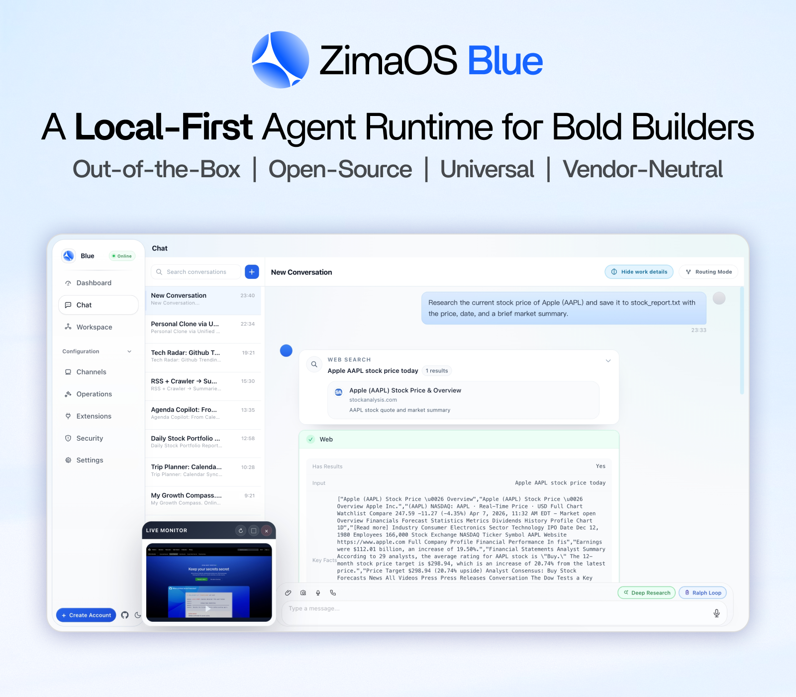
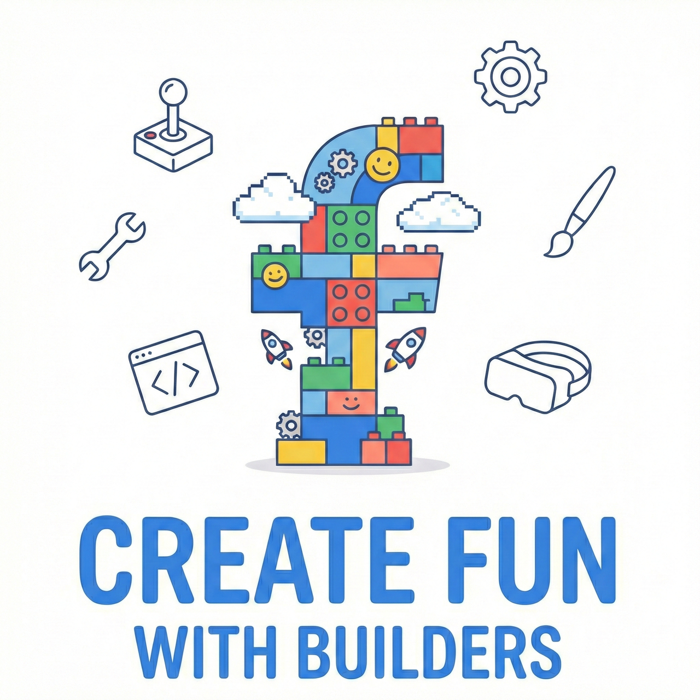
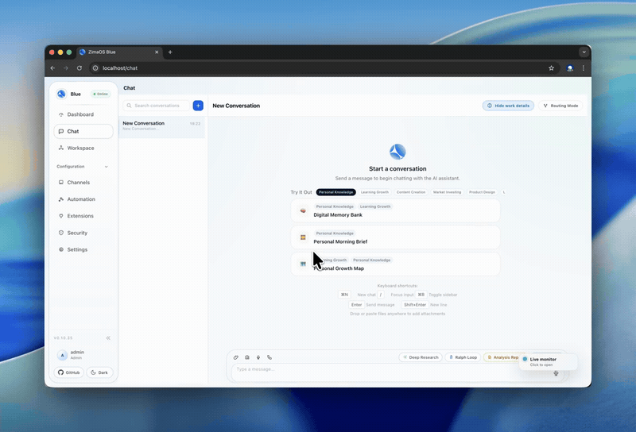
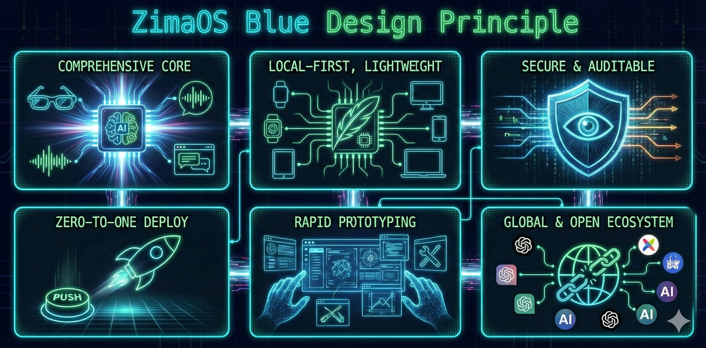
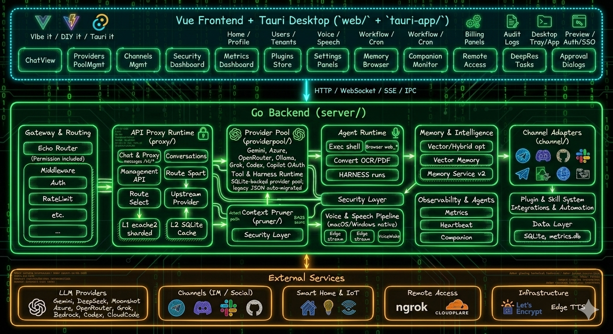
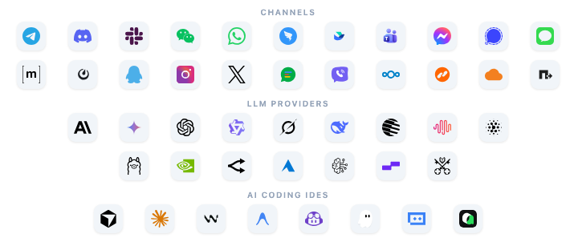
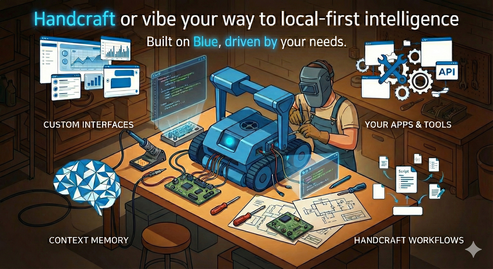
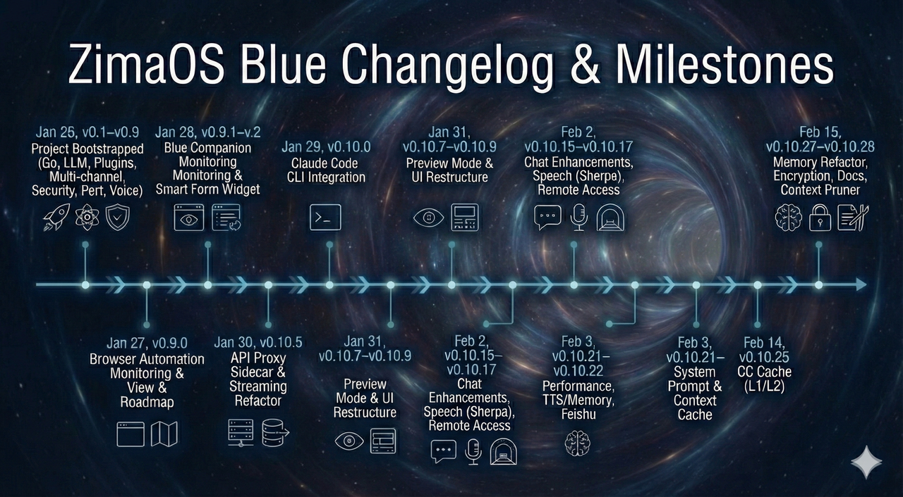

<p align="center">
  ZimaOS Blue: Timpeallacht rith gníomhairí <strong>áitiúil ar dtús</strong> do thógálaithe dána<br>
  Réidh le húsáid láithreach · Foinse oscailte · Uilíoch · Neodrach ó thaobh díoltóra de
</p>

<p align="center">
  <a href="../../README.md">English</a> |
  <a href="../ca_ES/README.md">Català</a> |
  <a href="../cs_CZ/README.md">Čeština</a> |
  <a href="../da_DK/README.md">Dansk</a> |
  <a href="../de_DE/README.md">Deutsch</a> |
  <a href="../el_GR/README.md">Ελληνικά</a> |
  <a href="../en_GB/README.md">English (UK)</a> |
  <a href="../es_ES/README.md">Español</a> |
  <a href="../fr_FR/README.md">Français</a> |
  <strong>Gaeilge</strong> |
  <a href="../hr_HR/README.md">Hrvatski</a> |
  <a href="../hu_HU/README.md">Magyar</a> |
  <a href="../it_IT/README.md">Italiano</a> |
  <a href="../ja_JP/README.md">日本語</a> |
  <a href="../ko_KR/README.md">한국어</a> |
  <a href="../ml_IN/README.md">മലയാളം</a> |
  <a href="../nb_NO/README.md">Norsk Bokmål</a> |
  <a href="../nl_NL/README.md">Nederlands</a> |
  <a href="../pl_PL/README.md">Polski</a> |
  <a href="../pt_BR/README.md">Português (BR)</a> |
  <a href="../pt_PT/README.md">Português (PT)</a> |
  <a href="../ro_RO/README.md">Română</a> |
  <a href="../ru_RU/README.md">Русский</a> |
  <a href="../sk_SK/README.md">Slovenčina</a> |
  <a href="../sv_SE/README.md">Svenska</a> |
  <a href="../zh_CN/README.md">简体中文</a> |
  <a href="../zh_TW/README.md">繁體中文</a>
</p>

<p align="center">
  <a href="https://github.com/IceWhaleTech/ZimaOS-Blue/actions"></a>
  <a href="https://github.com/IceWhaleTech/ZimaOS-Blue/releases"></a>
  <a href="../../LICENSE"></a>
</p>

<p align="center">
  <a href="https://discord.gg/b3AgFDxe9v"></a>&nbsp;&nbsp;
  <a href="https://www.facebook.com/zimaboard/"></a>&nbsp;&nbsp;
  <a href="https://x.com/ZimaSpace"></a>
</p>

## Réamhrá

Arna spreagadh ag Clawdbot, creidimid go mbeidh todhchaí na ríomhaireachta pearsanta á múnlú ag gníomhairí AI éagsúla den chéad áit a bheidh ag feidhmiú ar an imeall.

Is é ZimaOS Blue ár bhfreagra - am rite agus foireann uirlisí gníomhaire lán-fhoinse oscailte, in-iniúchta, díoltóir-neodrach agus réidh le táirgeadh a ligeann duit gníomhairí príobháideacha féin-óstáilte a sheoladh le frithchuimilt nialasach.

Tógtha d'fhorbróirí dána atá ag iarraidh a ngníomhairí féin a vibe nó lámhcheirde a dhéanamh, déantar innealtóireacht Blue le haghaidh feidhmíochta: scríofa in Go, le lorg cuimhne chomh híseal le 19 MB. Ritheann sé ar aon x86, Raspberry Pi, Windows, macOS — áit ar bith a phlocálann tú cumhacht.

## Taispeántais

### Comhrá agus cur i gcrích tascanna

Taispeántas gairid ar shreabhadh an chomhrá agus ar chur i gcrích tascanna i Blue.

<p align="center">
  
</p>

### Comhtháthú soláthraithe LLM

Taispeántas gairid ar thaithí Blue maidir le comhtháthú soláthraithe LLM.

<p align="center">
  
</p>

### Forbhreathnú tapa - Forbhreathnú, cainéil agus cumraíocht bhreise

Taispeántas gairid a chlúdaíonn forbhreathnú an táirge, na cainéil agus an chumraíocht bhreise.

<p align="center">
  
</p>

## Cén fáth Blue

<p align="center">
  
</p>

### Pure Go, Aon Ghléas

100% Téigh, dénártha statach. Tras-thiomsaítear chuig 5 sprioc é as an mbosca ( `linux/amd64`, `linux/arm64`,  `darwin/amd64`, `darwin/arm64`,  `windows/amd64`). Gan Node runtime, gan Python, agus gan aon choimeádáin de dhíth. Buail isteach é ar NAS, Raspberry Pi, sean-ródaire x86, nó Mac — ritheann sé. Ansin ciseal ar do Chomhéadain féin, loighic, agus scileanna gníomhaire - bunchód amháin, gach ardán.

### Amach as an mBosca, Réidh chun Oibre

Tá gach duine ag iarraidh uirlisí atá simplí, iontaofa, agus scála nuair is gá duit iad. Uirlisí nach n-oibríonn ach, ionas gur féidir leat díriú ar cad atá á thógáil agat i ndáiríre.

Ní fealsúnacht nua é seo. Is é an ceann céanna a thóg <a href="https://www.zimaspace.com/zimaos?utm_source=blue"></a> ZimaOS: simplí, iontaofa, agus tógtha chun fanacht amach as do bhealach. Is é Blue an fhealsúnacht sin, leathnaithe go dtí an Stack gníomhairí.

### Deartha do Do Bheatha, Tógtha chun Fanacht Áitiúil

Ó thaighde domhain a sheachadann tuairisc iomlán HTML, chuig OCR, PDF, uathoibriú brabhsálaí, agus comhshó doiciméad, láimhseálann Blue sreafaí oibre casta, fíor-dhomhain gan do shonraí a sheoladh chuig an scamall. Cuireann dúiseacht gutha, STT/TTS, Talk Mode, agus tacaíocht do thátal áitiúil, idirghníomhaíochtaí laethúla ar fáil láithreach, príobháideach agus ar fáil i gcónaí.

## Tús Tapa

### Rogha 1: Íoslódáil Aip Deisce

Faigh an feidhmchlár dúchais - gan aon spleáchais, gan aon tiomsú. Cumraíocht trialach ionsuite le dul ar bord i soicindí - cuir tús le comhrá láithreach trí nasc cianda, níl aon socrú bot ag teastáil. Taithí fíor lasmuigh den bhosca.

- **macOS**: [Íoslódáil DMG](https://github.com/IceWhaleTech/ZimaOS-Blue/releases/latest)
- **Windows**: [Íoslódálaí Suiteálaí](https://github.com/IceWhaleTech/ZimaOS-Blue/releases/latest)

### Rogha 2: Suiteáil Script

macOS / linux
```bash
curl -fsSL https://ota.zimaos.com/blue | sh
```

**Windows (PowerShell)**
```powershell
irm https://ota.zimaos.com/blue/windows | iex
```

### Rogha 3: Tóg ón bhFoinse

```bash
git clone https://github.com/IceWhaleTech/ZimaOS-Blue.git
cd ZimaOS-Blue
git submodule update --init --recursive
```

macOS / linux
```bash
sh build.sh
```

**Windows (PowerShell)**
```powershell
.\build.bat
```

> **Tabhair faoi deara:** Teastaíonn:
> - [MinGW-w64](https://www.mingw-w64.org/) (gcc) agus [CMake](https://cmake.org/) le haghaidh spleáchais dúchais C (espeak-ng, whisper.cpp, opus, kokoro, onnx)
> - [Windows SDK](https://developer.microsoft.com/en-us/windows/downloads/windows-sdk/) le haghaidh leabharlanna córais (winmm, etc.)
>
> Bí cinnte go bhfuil `gcc`, `cmake` i do `PATH`.

## Forbhreathnú Ailtireachta

<p align="center">
  
</p>

Tóg níos mó é: cuireann sé tacaíocht dhúchasach ar fáil do **20+ ardán IM**, **comhéadain ghuth-threoraithe** le haghaidh dialóg nádúrtha atá feasach ar an gcomhthéacs, **athrú samhail nialasach-config** le scanadh IDE.

<p align="center">
  
</p>

## Conas a Thógáil

<p align="center">
  
</p>

> ⚠️ [!IMPORTANT]
>
> Má tá sé ar intinn agat tiúnadh nó códú vibe a choinneáil ar bharr Blue, ná caith cúpla comhrá dea-bhéasach mar fhianaise scaoileadh. Ba cheart aon athrú a théann i bhfeidhm ar ródú, iompar forghníomhaithe, dromchla uirlisí, rialú buiséid, roghnú samhlacha, nó an creat forghníomhaithe a bhailíochtú le Blue Harness, ní le seiceálacha ad hoc ar an láthair.
>
> Ba cheart do Blue riail shimplí amháin a leanúint anseo: sonraí ar dtús, geataí ar dtús, gearrtha ar deireadh. Go praiticiúil, ciallaíonn sé sin an tacar sonraí ábhartha Harness / eval a nuashonrú roimh athrú a mheas, ansin ceann cobhsaí a choinneáil `candidate_id` ar fud na hiarrachta ar fad ionas go ndéanann tuairiscí roghnóir, forghníomhaithe, buiséid agus ullmhachta cur síos ar an iarrthóir céanna in ionad ceithre rith neamhghaolmhara.

### Molta Harness Sreabhadh Oibre

1. Rith `blue harness selector verify`
2. Rith `blue harness execution verify`
3. Athúsáid an rith eval roghnóireachta do `blue harness budget gate`
4. Críochnaigh le `blue harness cutover-readiness`

Le haghaidh atriallta áitiúil, bailíochtú oíche, nó bailiú fianaise CI, is fearr `python3 scripts/cutover_candidate_pipeline.py`. Ritheann sé an roghnóir iomlán -> forghníomhú -> buiséad -> seicheamh ullmhachta faoi aon iarrthóir roinnte, rud a fhágann gur fusa an toradh a chur i gcomparáid, a athbhreithniú agus a ghearradh siar.

### Ráillí Garda Breise

| Achar | Cad atá le Faire |
|-----|---------------|
| Cobhsaíocht bhunlíne | Coinnigh an bhunlíne, an leagan tacair sonraí, agus `candidate_id` cobhsaí, nó tiocfaidh an chomparáid agus ní bheidh an toradh iontaofa. |
| Fíor-aschur tógála | Déan an beart dénártha nó éadain lena mbaineann a atógáil roimh Harness a rith, nó d'fhéadfá iompar sean a bhailíochtú in ionad an athraithe reatha. |
| Clárú bealaigh | Má athraíonn an t-éadan agus an t-inneall le chéile, deimhnigh go bhfuil gach bealach inneall nua cláraithe i ndáiríre sula ndéantar breithiúnas ar an ngné trí iompar Chomhéadain, mar is minic gur cosúil le fabht loighciúil an clárú atá ar iarraidh ach gur `404` é i ndáiríre. |
| Breithiúnas scaoileadh | Ní bhíonn pas tiúnta réidh ach nuair nach léiríonn Harness aon chúlchéimniú fiúntach agus go ndeimhníonn ullmhacht gearrtha go bhfuil an t-iarrthóir réidh le gearradh siar. |

I mbeagán focal, ní bhaineann tiúnadh ar bharr Blue le "mothaíonn sé níos fearr i gcúpla comhrá." Is éard atá i gceist leis an iarrthóir a chur isteach i Harness, fianaise inchomparáide a bhailiú, agus ligean don gheata agus torthaí ullmhachta a chinneadh an bhfuil an t-athrú fíor-sábháilte le coinneáil.

## Gnéithe

| Gné | Cad a Sheachadann sé |
|--------|-----------------|
| Aisghabháil Gréasáin Ard-Infhaighteachta agus Am Rite Brabhsálaí | Duine de na **difritheoirí is géire** atá ag Blue. Comhaontaíonn Blue **ceithre chonair rochtana gréasáin** le haghaidh cuardaigh, léamh, eastóscadh agus sracaireacht; coinníonn **trí shraith chúltaca** trasna HTTP, eastóscadh seachfhreastalaí, agus seisiúin bhrabhsálaí; láimhseálann sé **leathanaigh frithbhot** le braite dúshláin, athúsáid fianán/seisiúin, stealth, agus aistriú brabhsálaí; agus bealaí trasna **trí inneall brabhsálaí**: `lightpanda`, Cróimiam arna bhainistiú, agus Cróimiam athsheachadáin/áitiúil. |
| Am Rite Taighde Trí-in-Aon | **Is féidir iontráil taighde poiblí amháin** a threorú chuig `deep_research`, `analyze`, agus `ui_review`. Táirgeann an fionnachtain chéanna agus an chruach fianaise ansin **taighde den chéad lua**, **tuarascálacha teorann**, agus **athbhreithnithe struchtúrtha UI/UX/inrochtaineachta**. |
| Harness Runtime, Meastóireacht, agus Creat Evolution | Déanann sé den mheastóireacht **príomhghné den runtime** trasna na forbartha, na hoiliúna agus na léiriúcháin. Clúdaíonn Harness **seiceálacha aischéimnithe agus smoke checks**, scóráil, bonnlínte, tuarascálacha, agus bailíochtú runtime, ansin iompraíonn sé an fhianaise chéanna chuig **éabhlóid scileanna**, meastóireacht leantach, cur chun cinn nó ais-rolladh, chomh maith le hathbhreithniú ar `AGENTS.md` nó ar mholtaí treorach. |
| Ilmhódach Dúchasach-Cumas-An Chéad Am Rite | Coinníonn **guth, OCR, PDF, tascanna brabhsálaí, comhshó doiciméad, líonadh foirme struchtúrtha, próiseáil na meán, agus giniúint meán** ar **chosáin dhúchais agus áitiúla ar dtús**, le **samhail ródú ach amháin nuair is gá i ndáiríre**. |
| Slándáil agus Rialachas | Áiríonn sé **forghníomhú bosca gainimh**, **cosaint phras-instealladh**, **iniúchadh seisiúin**, ceadanna, **RBAC**, **WebAuthn**, ráillí cosanta oibriúcháin, agus **scanadh slándála scileanna**. |
| LLM Vicí agus Spás Eolais | Déanann sé aschuir cuimhne, taighde agus ama rite ina **dromchla eolais cosúil le vicí** le **leathanaigh achomair**, innéacsanna, **aisnaisc**, **úire**, agus **sreafaí oibre cartlainne**. |
| Stór Scil agus Ionad an Mhargaidh | Longa **fionnachtain scileanna ionsuite**, coimeádaíocht, sioncronú, agus **scanadh áitiúil** mar sin tá insínteacht ar fáil **ón gcéad lá**. |
| Táirgeadh-Grád Soláthraí Linn | Soláthraíonn sé fíor-chomhthiomsú soláthraithe le **seiceálacha sláinte**, **teip uathoibríoch**, **scoradáin chiorcaid**, agus **rásaíocht soláthraithe** le haghaidh ualaí oibre fadtréimhseacha. |
| Am Rite Samhail Bheag Áitiúil Insuite | Seoltar am rite ionsuite **`Qwen3.5-0.8B` + `llama.cpp`** le haghaidh **Q&A gearr áitiúil**, aithint íomhá, ródú uirlisí, achoimriú, **comhbhrú comhthéacs**, agus **réamhphróiseáil doiciméad**. |
| Iontaofacht Fadreatha | Déileálann sé le **nuashonruithe OTA**, **cúltaca agus aisghabháil**, **athlódáil te ar an gcumraíocht**, agus **téarnamh iar-theipe** mar **ábhair oibriúcháin ionsuite**. |

## Amlíne Chloch Mhíle

<p align="center">
  
</p>

| Dáta | Leagan | Eochairfhocail / Gnéithe |
|-----|--------|--------------------|
| 26 Eanáir, 2026 | `v0.1–v0.9` | Téigh am rite, córas breiseán, uathoibriú brabhsálaí |
| 27–28 Eanáir, 2026 | `v0.9.0–v0.9.2` | Amharc tasc an bhrabhsálaí, Blue Companion, Smart Form Filler |
| 29–31 Eanáir, 2026 | `v0.10.0–v0.10.9` | Claude Code CLI, API Proxy, athstruchtúrú Chomhéadain |
| 1–3 Feabhra, 2026 | `v0.10.1–v0.10.22` | Méadracht, cianrochtain, taisce comhthéacs |
| 5–18 Feabhra, 2026 | `v0.10.25–v0.10.29` | i18n, CC Cache, píblíne scaoileadh |
| 20–25 Feabhra, 2026 | `v0.10.28–v0.10.29` | Lódaire deisce, UX soghluaiste, athdhearadh cuimhne |
| 28 Feabhra – 2 Márta, 2026 | `v0.10.30` | Deep Research, athrangóir scileanna, scanadh slándála |
| 9–18 Márta, 2026 | `v0.10.31` | Athchóiriú an phainéil, VoiceChat refactor, suíomhanna ceadaithe |
| 19–22 Márta, 2026 | `v0.10.32` | Harness rolladh amach, iniúchadh tras-scríofa, cuardach gréasáin |
| 23–25 Márta, 2026 | `v0.10.33` | Harness grúpaí, faomhadh brabhsálaí, margadh scileanna |
| 29–30 Márta, 2026 | `v0.10.35` | Harness v3, athsheoladh brabhsálaí, comhbhrú comhthéacs |
| 31 Márta – 1 Aibreán, 2026 | `v0.10.36` | Iniúchadh athscríbhinne, forleagan Harness, parsáil uirlisí |
| 1 Aibreán, 2026 | `v0.10.37` | Cruanú ama rite, Scil+Exec cutover, snas aisghabhála |
| 2–5 Aibreán, 2026 | `v0.10.38` | Tacaíocht GitHub, mionchoigeartú an mhargaidh, feabhsuithe iontaofachta |
| Aibreán 6–7, 2026 | `v0.10.39` | Aontú taighde, dromchlaí éabhlóide, laghdú lorg cuimhne |

## Pobal & Tacaíocht

- **Saincheisteanna**: [Faigh fabhtanna agus iarratais ar ghnéithe anseo, le do thoil](https://github.com/IceWhaleTech/ZimaOS-Blue/issues)
- **Plé**: [Discord](https://discord.gg/zwWbKA4S2)
- **Lean sinn** ar [GitHub](https://github.com/IceWhaleTech)

[](https://star-history.com/#IceWhaleTech/ZimaOS-Blue&Date)

## Ceadúnas

Tá an tionscadal seo ceadúnaithe faoi Cheadúnas MIT - féach an comhad [CEADÚNAIS](../../LICENSE) le haghaidh sonraí. Creidimid i bhfoinse oscailte agus i dtabhairt ar ais don phobal.

## Rannpháirtithe

Buíochas le gach rannpháirtí Blue:

<a href="https://community.vaunt.dev/board/IceWhaleTech/repository/ZimaOS-Blue">
  
</a>

## Tagairtí

1. **OpenClaw** — Gníomhaire áitiúil-an chéad fhoinse oscailte. Ceannródaíoch ag nascadh LLManna le gléasanna áitiúla trí oiriúntóirí cainéil agus glaoch uirlisí, ag spreagadh ailtireacht ama rite gníomhaire Blue go díreach. https://github.com/openclaw/openclaw
2. **MiroMind** — Modh taighde domhain le sintéis fianaise-bhunaithe. Píblíne domhain taighde ionsuite Blue: pleanáil, aisghabháil comhthreomhar, dídhúbailt fianaise, agus giniúint tuairisce HTML. https://www.miromind.ai
3. **Karpathy's LLM Wiki** — LLM mar tiomsaitheoir eolais. Athfhrámaíonn LLManna chun spásanna eolais leanúnacha athraitheacha a thógáil, ag bogadh thar ghaiste charntha RAG.
4. **OpenSpace (HKUDS)** — Inneall scileanna féinfhorbartha. Creat DAG-bhunaithe ina bhfoghlaimíonn gníomhairí ó theipeanna agus ina bhfaigheann siad sainscileanna. https://github.com/HKUDS/OpenSpace
5. **Andrew Ng's Context Hub** — Clár doiciméadaithe API leagan le haghaidh gníomhairí códaithe. Tugann sé aghaidh ar siabhránachtaí gníomhaire agus eolas seisiúin dearmadta. Soláthraíonn sé doic choimeádaithe leagan le lúba nótaí agus aiseolais, ag iompú doiciméadú ina ciseal eolais féinfheabhsaithe. https://github.com/andrewyng/context-hub
6. **Notion** — Simplí, daonna, agus d'aon ghnó ciúin. Spreagtha ag éiteas íostach Notion, Blue tugann sé teas ar ais don eangach. Nuair a chomhlíonann serif scagtha dearadh tuisceanach, cruthaítear spás a mhothaíonn mar bhaile. https://www.notion.com/about
7. **Matrix** — Inspioráid amhairc ó aeistéitiúil íocónach digiteach báistí. An treo aeistéitiúil do léaráidí teicniúla Blue.
8. **IceWhale** — Grá, Bás & Róbait S2E2 "Oighear". Comhthionól a bhailíonn ar fud an domhain chun briseadh trí bhallaí fathach idirlín agus chun cur i gcoinne comhchruinnithe sonraí. Is ionann an míol mór oighir agus pobal ag tógáil uirlisí ceannasacha le chéile ar an imeall.
9. **ZimaOS Blue** — Grá, Bás & Róbait S1E14 "Zima Blue". Meafar: faisnéis a thosaíonn i seirbhís agus a fhorbraíonn chun an domhan a iniúchadh. Is gníomhaire don eagna é Blue, atá fréamhaithe i simplíocht agus sroichte le doimhneacht.
10. **ZimaOS** — Prionsabail deartha Oscailte, Simplithe Dírithe. Creideann ZimaOS agus Blue araon gur cheart don teicneolaíocht freastal ar an úsáideoir - imscaradh i 30 soicind, rith áit ar bith, fanacht neodrach don díoltóir. https://www.zimaspace.com/zimaos
