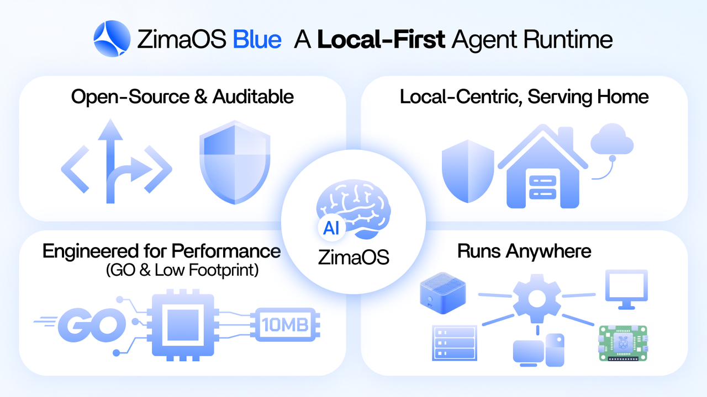

<p align="center">
  <a href="../../README.md">English</a> |
  <a href="../ca_ES/README.md">Català</a> |
  <a href="../cs_CZ/README.md">Čeština</a> |
  <a href="../da_DK/README.md">Dansk</a> |
  <a href="../de_DE/README.md">Deutsch</a> |
  <a href="../el_GR/README.md">Ελληνικά</a> |
  <a href="../en_GB/README.md">English (UK)</a> |
  <a href="../es_ES/README.md">Español</a> |
  <a href="../fr_FR/README.md">Français</a> |
  <a href="../ga_IE/README.md">Gaeilge</a> |
  <strong>Hrvatski</strong> |
  <a href="../hu_HU/README.md">Magyar</a> |
  <a href="../it_IT/README.md">Italiano</a> |
  <a href="../ja_JP/README.md">日本語</a> |
  <a href="../ko_KR/README.md">한국어</a> |
  <a href="../ml_IN/README.md">മലയാളം</a> |
  <a href="../nb_NO/README.md">Norsk Bokmål</a> |
  <a href="../nl_NL/README.md">Nederlands</a> |
  <a href="../pl_PL/README.md">Polski</a> |
  <a href="../pt_BR/README.md">Português (BR)</a> |
  <a href="../pt_PT/README.md">Português (PT)</a> |
  <a href="../ro_RO/README.md">Română</a> |
  <a href="../ru_RU/README.md">Русский</a> |
  <a href="../sk_SK/README.md">Slovenčina</a> |
  <a href="../sv_SE/README.md">Svenska</a> |
  <a href="../zh_CN/README.md">简体中文</a> |
  <a href="../zh_TW/README.md">繁體中文</a>
</p>

<p align="center">
  <a href="https://github.com/IceWhaleTech/ZimaOS-Blue/actions"></a>
  <a href="https://github.com/IceWhaleTech/ZimaOS-Blue/releases"></a>
  <a href="../../LICENSE"></a>
</p>

<p align="center">
  <a href="https://discord.gg/SrCYvumF"></a>&nbsp;&nbsp;
  <a href="https://www.facebook.com/zimaboard/"></a>&nbsp;&nbsp;
  <a href="https://x.com/ZimaSpace"></a>
</p>

## Uvod

Inspirirani Clawdbotom, vjerujemo da će **budućnost** osobnog računarstva biti **oblikovana raznolikim, lokalno orijentiranim AI agentima** koji rade na rubu mreže.

**ZimaOS Blue je naš odgovor** — potpuno **otvorenog koda, provjerljivo i spremno za produkciju okruženje za pokretanje agenata i skup alata** koji vam omogućuje isporuku privatnih, samostalno hostanih agenata bez ikakvih prepreka.

Izgrađen za odvažne programere koji žele **kreativno ili ručno izraditi vlastite agente**, Blue je **projektiran za performanse**: napisan u **Go** jeziku, s potrošnjom memorije od samo 10 MB. Radi na **bilo kojem x86 sustavu, Raspberry Pi-ju, Windowsu, macOS-u** — svugdje gdje ima struje.



## Značajke

### Lokalno orijentirani dizajn i automatski pristup modelima

Idemo dalje: nativna podrška za **20+ IM platformi**, **glasovno upravljana** sučelja za prirodan, kontekstualno svjestan dijalog, **prebacivanje modela bez konfiguracije** s IDE skeniranjem i SOUL-slojevite osobnosti.

<p align="center">
  
</p>

### Brzo i lagano

Nativno kompilirano u Go — bez interpretera, bez VM-a, bez opterećenja. Tiho radi na svemu, od servera do vaših stolnih uređaja.

| Metrika | ZimaOS Blue (Go) | OpenClaw (Node + dist) |
|---------|-------------------|------------------------|
| `--help` hladno / toplo | **0.18 s / < 0.01 s** | 3.31 s / ~1.11 s |
| `status` vrijeme izvršavanja (najbolje od 3) | **< 0.01 s** | 5.98 s |
| `--help` vršni RSS | **~10 MB** | ~394 MB |
| `status` vršni RSS | **~15 MB** | ~1.52 GB |
| Ovisnosti za pokretanje | **Nema** | Node.js 18+ |

> Mjereno na macOS arm64, isti host, najbolje od 3 pokretanja. Velj. 2026.

### Čisti Go, bilo koji uređaj

100% Go, statička binarna datoteka. **Križna kompilacija za 5 ciljnih platformi** odmah dostupna ( amd64/arm64,  amd64/arm64,  amd64). Bez Node okruženja, bez Pythona, bez kontejnera. Stavite ga na NAS, Raspberry Pi, stari x86 usmjerivač ili Mac — jednostavno radi. **Zatim dodajte vlastito korisničko sučelje, logiku i vještine agenata** — jedna baza koda, svaka platforma.

### Sigurnost i upravljanje

Ugrađeni sidecar API proxy s dubinskom obranom:
- **Izvršavanje u sandboxu** – Svi pozivi alata izvršavaju se u izoliranim okruženjima.
- **Obrana od prompt injekcija** – 7+ ugrađenih strategija presretanja.
- **Revizija sesija** – Potpuno praćenje sesija, svaka interakcija je sljediva.
- **RBAC i WebAuthn** – Detaljno upravljanje pristupom s autentifikacijom bez lozinke.

## Zašto Blue

Vjerujemo da **osobno računarstvo sljedeće generacije** prihvaća LLM-ove — ali **kontrolirani, provjerljivi** agenti ostaju temelj za pojedince i timove. **Blue pruža**:
- **Sveobuhvatna jezgra** – Napredno upravljanje modelima, IM integracija, poboljšana persona i sučelja na prirodnom jeziku prilagođena svakodnevnim interakcijama (slušalice, glas, pametne naočale).
- **Lokalno orijentirano, ultra lagano, višeuređajno** – Nije potreban vrhunski hardver. Radi na svemu što može računati.
- **Sigurno i provjerljivo** – Revizija sesija, sandboxing, kontrole dozvola i ugrađeni API proxy koji djeluje kao vatrozid aplikacijskog sloja — svaki bajt ulaza/izlaza je vidljiv.

Smanjujemo predloške koda kako biste se **usredotočili na ono što je važno**. Vjerni <a href="https://www.zimaspace.com/zimaos?utm_source=blue"></a> **dizajnerskoj filozofiji ZimaOS-a**, Blue pruža:
- **Od nule do jedan jednim klikom** – Trenutačna implementacija, bez složene konfiguracije.
- **Brzo prototipiranje** – Kreativno ili ručno izradite alate, interakcije i pakete aplikacija specifične za scenarij.
- **Globalno spremno** – **Svijet je velik** i ne govori zadano engleski. **20+ jezika, nativno**, bez prepreka.
- **Otvoreni ekosustav modela** – Bez vezanosti za dobavljača. Donesite vlastite modele.


## Brzi početak

### Opcija 1: Preuzimanje desktop aplikacije

Preuzmite nativnu aplikaciju — bez ovisnosti, bez kompiliranja.

- **macOS**: [Preuzmi DMG](https://github.com/IceWhaleTech/ZimaOS-Blue/releases/latest)
- **Windows**: [Preuzmi instalacijski program](https://github.com/IceWhaleTech/ZimaOS-Blue/releases/latest)

### Opcija 2: Instalacijska skripta

macOS / linux
```bash
curl -fsSL https://ota.zimaos.com/blue | sh
```

**Windows (PowerShell)**
```powershell
irm https://ota.zimaos.com/blue/windows | iex
```

### Opcija 3: Izgradnja iz izvornog koda

```bash
git clone https://github.com/IceWhaleTech/ZimaOS-Blue.git
cd ZimaOS-Blue
```

macOS / linux
```bash
sh build.sh
```

**Windows (PowerShell)**
```powershell
.\build.bat
```

> **Note:** Windows builds require [MinGW-w64](https://www.mingw-w64.org/) (gcc) and [CMake](https://cmake.org/) for native C dependencies (espeak-ng, whisper.cpp, opus). Make sure `gcc` and `cmake` are in your `PATH`.

## Pregled arhitekture


### Tok podataka

**Chat zahtjev (Proxy vrući put)**
```
Client [Proxy API Key] → Auth Gate → Prompt Guard → Context Pruner (optional)
  → Provider Pool (route:auto/cloud/local) → CC Cache (L1→L2) check
  → Upstream LLM → Response → Cache Store → Metrics Writer → Client (SSE stream)
```

**Tok poruka kanala**
```
Telegram/Discord/... → Channel Manager → AutoReply check
  → Chat Handler → LLM → Humanizer (MD→text) → Channel → User
```

**Glasovni cjevovod**
```
WebSocket audio → STT (Whisper) → LLM Processing → TTS (eSpeak/Edge) → WebSocket audio
```

### Mapa paketa (`server/internal/`)

| Sloj | Paketi |
|------|--------|
| Gateway | bootstrap, server, gateway |
| Proxy | proxy, connection, streaming, resilience |
| Pružatelj | providerpool, providers, llm |
| Pruner | pruner (detector, segmenter, bm25, pipeline, cache) |
| Agent | context, tools, personality, humanizer |
| Memorija | memory, embedding, kvstore |
| Kanal | channel, autoreply, i18n |
| Sigurnost | security, auth, permission, rbac, mfa, password, oidc, extauth, sandbox, promptguard, audit |
| Glas | voice, tts, stt, speech |
| Nadzor | metrics, heartbeat, companion, profiling, leakdetect |
| Dodatak | plugin, skill, skillstore |
| Integracija | browser, homeassistant, cron, workflow, formfiller, tunnel, crawler |
| Raspoređivač | scheduler, worker, workerpool, pool |
| Jezgra | lifecycle, config, logger, database, cache, ratelimit, retry, timeutil, sync |
| Sustav | sysinfo, cgroup, iotask, watcher, resources, backup, update |
| Višekorisničko | tenant, user, session, preview |

## Kako koristiti


## Vremenski plan prekretnica


| Version | Fokus | Ključna vrijednost | Status |
|---------|-------|--------------------|--------|
| v0.1 | Jezgra Go okruženja | Stabilna jezgra, 24h rad | Done |
| v0.2 | Osnovne mogućnosti | Minimalno upotrebljivo, LLM integracija | Done |
| v0.3 | NAS integracija | NAS nativno, systemd podrška | Done |
| v0.4 | Sustav dodataka | Proširivo, osnove sigurnosti | Done |
| v0.5 | Produktna osnova | Spremno za produkciju, dokumentacija | Done |
| v0.6 | Kanali za poruke | Podrška za više kanala | Done |
| v0.7 | Sigurnost | OIDC, MFA, revizija | Done |
| v0.8 | Performanse | Optimizacija, predmemoriranje, mjerila | Done |
| v0.9 | Ekosustav | Višekorisničko, automatizacija preglednika, glas | Done |
| v0.10.0 | CLI pakiranje | CC CLI pakiranje, detekcija, automatsko ažuriranje | Done |
| v0.10.1 | Praćenje metrika | API statistike, praćenje tokena, TTFT | Done |
| v0.10.2 | CLI pouzdanost | Životni ciklus procesa, oporavak od grešaka | Done |
| v0.10.3 | CLI integracija | Čarobnjak za postavljanje, automatska detekcija pružatelja | Done |
| v0.10.4 | Tauri pakiranje | Desktop aplikacija, sistemska traka | Done |
| v0.10.5 | API Proxy Sidecar | Odabir rute, zaštita upita, statistike korištenja | Done |
| v0.10.6 | Skup pružatelja | Usmjeravanje više pružatelja, provjera zdravlja, prebacivanje | Done |
| v0.10.7 | Način pregleda | Neautentificirani pristup, ograničavanje značajki | Done |
| v0.10.8 | Trgovina vještina | Infrastruktura trgovine vještina, validacija kanala | Done |
| v0.10.9–10 | Upravljanje korisnicima | Podkorisnici, dozvole na razini stranice | Done |
| v0.10.13–14 | Sigurnost i vještine | Stranica sigurnosti, redizajn trgovine vještina | Done |
| v0.10.15 | Poboljšanja chata | Chat UX, cjevovod poruka | Done |
| v0.10.16 | Glasovni modul | Sherpa TTS/ASR, eSpeak, prebacivanje pružatelja | Done |
| v0.10.17 | Udaljeni pristup | Ngrok, Cloudflare tuneli, ACME certifikati | Done |
| v0.10.18–20 | Sprint performansi | Performanse pokretanja/chata, predmemorija konteksta | Done |
| v0.10.21–22 | Prompt i DingTalk | Sistemski prompt, DingTalk kanal | Done |
| v0.10.23 | OTA ažuriranje | Sustav OTA ažuriranja | Done |
| v0.10.24 | Nadogradnja kanala | 10 kanala nadograđeno iz stubova | Done |
| v0.10.25 | CC Cache | Dvoslojna predmemorija (L1 memorija + L2 disk) | Done |
| v0.10.26 | Humanizer | Cjevovod humanizacije odgovora | Done |
| v0.10.27 | Context Pruner | 54% ušteda tokena na kodu (SWE-bench službeno), 46–47% na općim dokumentima (lokalni IR), BM25 bodovanje, segmentacija | Done |
| v0.10.28 | Memory Service | Progresivno pretraživanje, dual-write backend | Done |

## Zajednica i podrška

- **Problemi**: [Molimo prijavite greške i zahtjeve za značajke ovdje](https://github.com/IceWhaleTech/ZimaOS-Blue/issues)
- **Rasprave**: [Discord](https://discord.gg/SrCYvumF)
- **Pratite nas** na [GitHub](https://github.com/IceWhaleTech)

## Licenca

Ovaj projekt je licenciran pod MIT licencom — pogledajte datoteku [LICENSE](../../LICENSE) za detalje. Vjerujemo u otvoreni kod i vraćanje zajednici.

## Suradnici

<p align="center">
  Made with ❤️ by <a href="https://github.com/IceWhaleTech">IceWhaleTech</a>
</p>
