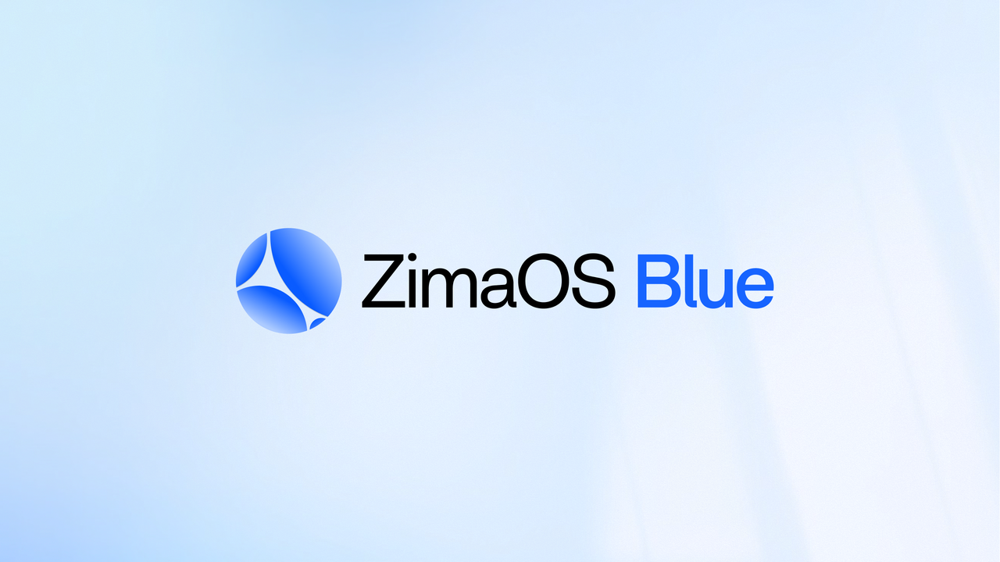

<h2 align="center">ZimaOS Blue: ധീരമായ നിർമ്മാതാക്കൾക്കായുള്ള ലോക്കൽ-ഫസ്റ്റ് ഏജന്റ് റൺടൈം</h2>

<p align="center"><strong>ഉടൻ ഉപയോഗിക്കാൻ തയ്യാറായത് · ഓപ്പൺ സോഴ്‌സ് · സർവസാധാരം · വെൻഡർ-ന്യൂട്രൽ</strong></p>

<p align="center">
  <a href="../../README.md">English</a> |
  <a href="../ca_ES/README.md">Català</a> |
  <a href="../cs_CZ/README.md">Čeština</a> |
  <a href="../da_DK/README.md">Dansk</a> |
  <a href="../de_DE/README.md">Deutsch</a> |
  <a href="../el_GR/README.md">Ελληνικά</a> |
  <a href="../en_GB/README.md">English (UK)</a> |
  <a href="../es_ES/README.md">Español</a> |
  <a href="../fr_FR/README.md">Français</a> |
  <a href="../ga_IE/README.md">Gaeilge</a> |
  <a href="../hr_HR/README.md">Hrvatski</a> |
  <a href="../hu_HU/README.md">Magyar</a> |
  <a href="../it_IT/README.md">Italiano</a> |
  <a href="../ja_JP/README.md">日本語</a> |
  <a href="../ko_KR/README.md">한국어</a> |
  <strong>മലയാളം</strong> |
  <a href="../nb_NO/README.md">Norsk Bokmål</a> |
  <a href="../nl_NL/README.md">Nederlands</a> |
  <a href="../pl_PL/README.md">Polski</a> |
  <a href="../pt_BR/README.md">Português (BR)</a> |
  <a href="../pt_PT/README.md">Português (PT)</a> |
  <a href="../ro_RO/README.md">Română</a> |
  <a href="../ru_RU/README.md">Русский</a> |
  <a href="../sk_SK/README.md">Slovenčina</a> |
  <a href="../sv_SE/README.md">Svenska</a> |
  <a href="../zh_CN/README.md">简体中文</a> |
  <a href="../zh_TW/README.md">繁體中文</a>
</p>

<p align="center">
  <a href="https://github.com/IceWhaleTech/ZimaOS-Blue/actions"></a>
  <a href="https://github.com/IceWhaleTech/ZimaOS-Blue/releases"></a>
  <a href="../../LICENSE"></a>
</p>

<p align="center">
  <a href="https://discord.gg/b3AgFDxe9v"></a>&nbsp;&nbsp;
  <a href="https://www.facebook.com/zimaboard/"></a>&nbsp;&nbsp;
  <a href="https://x.com/ZimaSpace"></a>
</p>

## ആമുഖം

Clawdbot-ൽ നിന്ന് പ്രചോദനം ഉൾക്കൊണ്ട്, പേഴ്സണൽ കമ്പ്യൂട്ടിംഗിൻ്റെ ഭാവി രൂപപ്പെടുത്തുന്നത് വൈവിധ്യമാർന്ന, പ്രാദേശിക-ആദ്യത്തെ AI ഏജൻ്റുമാരാൽ അരികിൽ പ്രവർത്തിക്കുന്നതാണെന്ന് ഞങ്ങൾ വിശ്വസിക്കുന്നു.

ZimaOS Blue എന്നതാണ് ഞങ്ങളുടെ ഉത്തരം — പൂർണ്ണമായും ഓപ്പൺ സോഴ്‌സ്, ഓഡിറ്റബിൾ, വെണ്ടർ-ന്യൂട്രൽ, പ്രൊഡക്ഷൻ-റെഡി ഏജൻ്റ് റൺടൈം, ടൂൾകിറ്റ് എന്നിവ സ്വകാര്യവും സ്വയം ഹോസ്റ്റ് ചെയ്യുന്നതുമായ ഏജൻ്റുമാരെ സീറോ ഘർഷണത്തോടെ അയയ്ക്കാൻ നിങ്ങളെ അനുവദിക്കുന്നു.

സ്വന്തം ഏജൻ്റുമാരെ വൈബ് ചെയ്യാനോ കരകൗശലമാക്കാനോ ആഗ്രഹിക്കുന്ന ബോൾഡ് ഡെവലപ്പർമാർക്കായി നിർമ്മിച്ചതാണ്, Blue പ്രകടനത്തിനായി രൂപകൽപ്പന ചെയ്‌തതാണ്: Go- ൽ എഴുതിയത്, 19 MB-യിൽ താഴെയുള്ള മെമ്മറി ഫൂട്ട്‌പ്രിൻ്റ്. ഏത് x86, Raspberry Pi, Windows, macOS — നിങ്ങൾ പവർ പ്ലഗ് ഇൻ ചെയ്യുന്ന എവിടെയും ഇത് പ്രവർത്തിക്കുന്നു.

## ഡെമോകൾ

### സംഭാഷണവും ടാസ്‌ക് നിർവഹണവും

Blueയിലെ സംഭാഷണ പ്രവാഹവും ടാസ്‌ക് നിർവഹണവും കാണിക്കുന്ന ഒരു വേഗത്തിലുള്ള ഡെമോ.

<p align="center">
  
</p>

### LLM പ്രൊവൈഡർ ഇന്റഗ്രേഷൻ

Blueയിലെ LLM പ്രൊവൈഡർ ഇന്റഗ്രേഷൻ അനുഭവം കാണിക്കുന്ന ഒരു വേഗത്തിലുള്ള ഡെമോ.

<p align="center">
  
</p>

### ദ്രുത അവലോകനം - അവലോകനം, ചാനലുകൾ, അധിക കോൺഫിഗറേഷൻ

ഉൽപ്പന്നത്തിന്റെ ആകെ അവലോകനം, ചാനലുകൾ, അധിക കോൺഫിഗറേഷൻ എന്നിവ കാണിക്കുന്ന ഒരു വേഗത്തിലുള്ള ഡെമോ.

<p align="center">
  
</p>

## എന്തുകൊണ്ട് Blue

<p align="center">
  
</p>

### പ്യുവർ ഗോ, ഏത് ഉപകരണവും

100% പോകുക, സ്റ്റാറ്റിക് ബൈനറി. ബോക്‌സിന് പുറത്തുള്ള 5 ടാർഗെറ്റുകളിലേക്ക് ക്രോസ്-കംപൈൽ ചെയ്യുന്നു ( `linux/amd64`, `linux/arm64`,  `darwin/amd64`, `darwin/arm64`, `windows/amd64`). നോഡ് റൺടൈം ഇല്ല, പൈത്തൺ ഇല്ല, കണ്ടെയ്നറുകൾ ആവശ്യമില്ല. ഒരു NAS, Raspberry Pi, ഒരു പഴയ x86 റൂട്ടർ, അല്ലെങ്കിൽ Mac എന്നിവയിൽ ഇത് ഡ്രോപ്പ് ചെയ്യുക - ഇത് പ്രവർത്തിക്കുന്നു. തുടർന്ന് നിങ്ങളുടെ സ്വന്തം യുഐ, ലോജിക്, ഏജൻ്റ് കഴിവുകൾ എന്നിവയിൽ ലെയർ ചെയ്യുക - ഒരു കോഡ്ബേസ്, ഓരോ പ്ലാറ്റ്ഫോമും.

### ബോക്‌സിന് പുറത്ത്, പ്രവർത്തിക്കാൻ തയ്യാറാണ്

എല്ലാവർക്കും ലളിതവും വിശ്വസനീയവും നിങ്ങൾക്ക് ആവശ്യമുള്ളപ്പോൾ സ്കെയിൽ ഉള്ളതുമായ ഉപകരണങ്ങൾ വേണം. പ്രവർത്തിക്കുന്ന ഉപകരണങ്ങൾ, അതിനാൽ നിങ്ങൾ യഥാർത്ഥത്തിൽ നിർമ്മിക്കുന്ന കാര്യങ്ങളിൽ ശ്രദ്ധ കേന്ദ്രീകരിക്കാൻ കഴിയും.

ഇതൊരു പുതിയ തത്വശാസ്ത്രമല്ല. <a href="https://www.zimaspace.com/zimaos?utm_source=blue"></a>ZimaOS: ലളിതവും വിശ്വസനീയവും നിങ്ങളുടെ വഴിയിൽ നിന്ന് വിട്ടുനിൽക്കാൻ നിർമ്മിച്ചതും ഇത് തന്നെയാണ്. Blue എന്നത് ആ തത്ത്വചിന്തയാണ്, ഏജൻ്റ് സ്റ്റാക്കിലേക്ക് വ്യാപിച്ചിരിക്കുന്നു.

### നിങ്ങളുടെ ജീവിതത്തിനായി രൂപകൽപ്പന ചെയ്‌തത്, പ്രാദേശികമായി തുടരാൻ നിർമ്മിച്ചതാണ്

പൂർണ്ണമായ HTML റിപ്പോർട്ട് നൽകുന്ന ആഴത്തിലുള്ള ഗവേഷണത്തിൽ നിന്ന്, OCR, PDF, ബ്രൗസർ ഓട്ടോമേഷൻ, ഡോക്യുമെൻ്റ് കൺവേർഷൻ എന്നിവയിലേക്ക്, Blue നിങ്ങളുടെ ഡാറ്റ ക്ലൗഡിലേക്ക് അയയ്‌ക്കാതെ സങ്കീർണ്ണവും യഥാർത്ഥവുമായ വർക്ക്ഫ്ലോകൾ കൈകാര്യം ചെയ്യുന്നു. വോയ്‌സ് വേക്ക്, STT/TTS, Talk Mode, പ്രാദേശിക അനുമാനത്തിനുള്ള പിന്തുണ എന്നിവ ദൈനംദിന ഇടപെടലുകളെ തൽക്ഷണവും സ്വകാര്യവും എല്ലായ്‌പ്പോഴും ലഭ്യമാക്കുന്നു.

## ദ്രുത തുടക്കം

### ഓപ്ഷൻ 1: ഡെസ്ക്ടോപ്പ് ആപ്പ് ഡൗൺലോഡ് ചെയ്യുക

നേറ്റീവ് ആപ്ലിക്കേഷൻ നേടുക - ഡിപൻഡൻസികളില്ല, സമാഹരണമില്ല. നിമിഷങ്ങൾക്കുള്ളിൽ ഓൺബോർഡിംഗ് ഉള്ള ബിൽറ്റ്-ഇൻ ട്രയൽ കോൺഫിഗറേഷൻ - റിമോട്ട് കണക്ഷൻ വഴി തൽക്ഷണം ചാറ്റ് ചെയ്യാൻ ആരംഭിക്കുക, ബോട്ട് സജ്ജീകരണത്തിൻ്റെ ആവശ്യമില്ല. യഥാർത്ഥ ഔട്ട്-ഓഫ്-ബോക്സ് അനുഭവം.

- **macOS**: [DMG ഡൗൺലോഡ് ചെയ്യുക](https://github.com/IceWhaleTech/ZimaOS-Blue/releases/latest)
- **Windows**: [ഇൻസ്റ്റാളർ ഡൗൺലോഡ് ചെയ്യുക](https://github.com/IceWhaleTech/ZimaOS-Blue/releases/latest)

### ഓപ്ഷൻ 2: സ്ക്രിപ്റ്റ് ഇൻസ്റ്റാൾ ചെയ്യുക

macOS / linux
```bash
curl -fsSL https://ota.zimaos.com/blue | sh
```

**Windows (PowerShell)**
```powershell
irm https://ota.zimaos.com/blue/windows | iex
```

### ഓപ്ഷൻ 3: ഉറവിടത്തിൽ നിന്ന് നിർമ്മിക്കുക

```bash
git clone https://github.com/IceWhaleTech/ZimaOS-Blue.git
cd ZimaOS-Blue
git submodule update --init --recursive
```

macOS / linux
```bash
sh build.sh
```

**Windows (PowerShell)**
```powershell
.\build.bat
```

> **ശ്രദ്ധിക്കുക:** വിൻഡോസ് ബിൽഡിന് ആവശ്യമാണ്:
> - [MinGW-w64](https://www.mingw-w64.org/) (gcc) കൂടാതെ [CMake](https://cmake.org/) നേറ്റീവ് സി ഡിപൻഡൻസികൾക്കായി (espeak-ng, whisper.cpp, opus, kokoro, onnx)
> - [Windows SDK](https://developer.microsoft.com/en-us/windows/downloads/windows-sdk/) സിസ്റ്റം ലൈബ്രറികൾക്കായി (winmm, മുതലായവ)
>
> `gcc`, `cmake` നിങ്ങളുടെ `PATH`-ൽ ഉണ്ടെന്ന് ഉറപ്പാക്കുക.

## വാസ്തുവിദ്യയുടെ അവലോകനം

<p align="center">
  
</p>

ഇത് കൂടുതൽ മുന്നോട്ട് കൊണ്ടുപോകുക: ഇത് **20+ IM പ്ലാറ്റ്‌ഫോമുകൾക്കുള്ള നേറ്റീവ് പിന്തുണ നൽകുന്നു**, **വോയ്‌സ്-ഡ്രൈവൺ** സ്വാഭാവിക, സന്ദർഭ-അവബോധ സംഭാഷണത്തിനുള്ള ഇൻ്റർഫേസുകൾ, **സീറോ-കോൺഫിഗ് മോഡൽ സ്വിച്ചിംഗ്** IDE സ്കാനിംഗിനൊപ്പം.

<p align="center">
  
</p>

## എങ്ങനെ നിർമ്മിക്കാം

<p align="center">
  
</p>

> ⚠️ [!IMPORTANT]
>
> Blue എന്നതിന് മുകളിൽ ട്യൂണിങ്ങോ വൈബ് കോഡിംഗോ തുടരാൻ നിങ്ങൾ ആഗ്രഹിക്കുന്നുവെങ്കിൽ, കുറച്ച് നല്ല ചാറ്റുകൾ റിലീസ് തെളിവായി കണക്കാക്കരുത്. റൂട്ടിംഗ്, എക്സിക്യൂഷൻ സ്വഭാവം, ടൂൾ ഉപരിതലം, ബജറ്റ് നിയന്ത്രണം, മോഡൽ തിരഞ്ഞെടുക്കൽ അല്ലെങ്കിൽ നിർവ്വഹണ ചട്ടക്കൂട് എന്നിവയെ ബാധിക്കുന്ന ഏത് മാറ്റവും Blue Harness ഉപയോഗിച്ച് സാധൂകരിക്കണം, അഡ്‌ഹോക്ക് സ്പോട്ട് ചെക്കുകൾ ഉപയോഗിച്ചല്ല.
>
> Blue ഇവിടെ ഒരു ലളിതമായ നിയമം പാലിക്കണം: ഡാറ്റ ആദ്യം, ഗേറ്റുകൾ ആദ്യം, അവസാനം വെട്ടി. പ്രായോഗികമായി, അതിനർത്ഥം ഒരു മാറ്റത്തെ വിലയിരുത്തുന്നതിന് മുമ്പ് പ്രസക്തമായ Harness ഡാറ്റാസെറ്റ് / എവൽ സ്‌പെക്ക് അപ്‌ഡേറ്റ് ചെയ്യുക, തുടർന്ന് മുഴുവൻ ശ്രമത്തിലുടനീളം ഒരു സ്ഥിരതയുള്ള `candidate_id` നിലനിർത്തുക, അങ്ങനെ സെലക്ടർ, എക്‌സിക്യൂഷൻ, ബജറ്റ്, റെഡിനസ് റിപ്പോർട്ടുകൾ എന്നിവയെല്ലാം ബന്ധമില്ലാത്ത നാല് റണ്ണുകൾക്ക് പകരം ഒരേ സ്ഥാനാർത്ഥിയെ വിവരിക്കുന്നു.

### ശുപാർശ ചെയ്തത് Harness വർക്ക്ഫ്ലോ

1. `blue harness selector verify` പ്രവർത്തിപ്പിക്കുക
2. `blue harness execution verify` പ്രവർത്തിപ്പിക്കുക
3. `blue harness budget gate` എന്നതിനായി സെലക്ടർ എവൽ റൺ വീണ്ടും ഉപയോഗിക്കുക
4. `blue harness cutover-readiness` ഉപയോഗിച്ച് പൂർത്തിയാക്കുക

പ്രാദേശിക ആവർത്തനത്തിനും രാത്രി മൂല്യനിർണ്ണയത്തിനും അല്ലെങ്കിൽ CI തെളിവ് ശേഖരണത്തിനും `python3 scripts/cutover_candidate_pipeline.py` തിരഞ്ഞെടുക്കുക. ഇത് ഫുൾ സെലക്ടർ -> എക്സിക്യൂഷൻ -> ബഡ്ജറ്റ് -> റെഡിനസ് സീക്വൻസ് ഒരു പങ്കിട്ട കാൻഡിഡേറ്റിന് കീഴിൽ പ്രവർത്തിക്കുന്നു, ഇത് ഫലം താരതമ്യം ചെയ്യാനും അവലോകനം ചെയ്യാനും വെട്ടിമാറ്റാനും എളുപ്പമാക്കുന്നു.

### അധിക ഗാർഡ്രെയിലുകൾ

| ഏരിയ | എന്താണ് കാണേണ്ടത് |
|------|---------------|
| അടിസ്ഥാന സ്ഥിരത | ബേസ്‌ലൈൻ, ഡാറ്റാസെറ്റ് പതിപ്പ്, `candidate_id` എന്നിവ സ്ഥിരത നിലനിർത്തുക, അല്ലെങ്കിൽ താരതമ്യം ഡ്രിഫ്റ്റ് ചെയ്യും, ഫലം വിശ്വസനീയമാകില്ല. |
| യഥാർത്ഥ ബിൽഡ് ഔട്ട്പുട്ട് | Harness റൺ ചെയ്യുന്നതിനുമുമ്പ് ബാധിച്ച ബൈനറി അല്ലെങ്കിൽ ഫ്രണ്ട്എൻഡ് ബണ്ടിൽ പുനർനിർമ്മിക്കുക, അല്ലാത്തപക്ഷം നിലവിലെ മാറ്റത്തിന് പകരം നിങ്ങൾക്ക് പഴകിയ സ്വഭാവം സാധൂകരിക്കാനാകും. |
| റൂട്ട് രജിസ്ട്രേഷൻ | ഫ്രണ്ട്എൻഡും ബാക്കെൻഡും ഒരുമിച്ച് മാറുകയാണെങ്കിൽ, എല്ലാ പുതിയ ബാക്കെൻഡ് റൂട്ടുകളും യുഐ പെരുമാറ്റത്തിലൂടെ സവിശേഷത വിലയിരുത്തുന്നതിന് മുമ്പ് യഥാർത്ഥത്തിൽ രജിസ്റ്റർ ചെയ്തിട്ടുണ്ടെന്ന് സ്ഥിരീകരിക്കുക, കാരണം രജിസ്‌ട്രേഷൻ നഷ്‌ടപ്പെടുന്നത് പലപ്പോഴും ഒരു ലോജിക് ബഗ് പോലെയാണെങ്കിലും യഥാർത്ഥത്തിൽ `404` ആണ്. |
| വിധി റിലീസ് | Harness അർത്ഥവത്തായ റിഗ്രഷനൊന്നും കാണിക്കുകയും കട്ട്ഓവർ-റെഡിനെസ്സ് കാൻഡിഡേറ്റ് യഥാർത്ഥത്തിൽ വെട്ടിക്കുറയ്ക്കാൻ തയ്യാറാണെന്ന് സ്ഥിരീകരിക്കുകയും ചെയ്യുമ്പോൾ മാത്രമേ ട്യൂണിംഗ് പാസ് തയ്യാറാകൂ. |

ചുരുക്കത്തിൽ, Blue എന്നതിന് മുകളിൽ ട്യൂൺ ചെയ്യുന്നത് "കുറച്ച് ചാറ്റുകളിൽ മികച്ചതായി തോന്നുന്നു" എന്നതിനെ കുറിച്ചല്ല. ഇത് സ്ഥാനാർത്ഥിയെ Harness എന്നതിലേക്ക് മാറ്റുക, താരതമ്യപ്പെടുത്താവുന്ന തെളിവുകൾ ശേഖരിക്കുക, മാറ്റം യഥാർത്ഥത്തിൽ സുരക്ഷിതമാണോ എന്ന് തീരുമാനിക്കാൻ ഗേറ്റ്, റെഡിനെസ് ഫലങ്ങൾ എന്നിവയെ അനുവദിക്കുന്നു.

## സവിശേഷതകൾ

| സവിശേഷത | ഇത് എന്താണ് നൽകുന്നത് |
|---------|------------------|
| ഉയർന്ന ലഭ്യതയുള്ള വെബ് വീണ്ടെടുക്കലും ബ്രൗസർ പ്രവർത്തന സമയവും | Blueയുടെ **മൂർച്ചയുള്ള വ്യതിരിക്തതകളിൽ ഒന്ന്**. Blue തിരയുന്നതിനും വായിക്കുന്നതിനും എക്‌സ്‌ട്രാക്‌റ്റുചെയ്യുന്നതിനും ക്രാൾ ചെയ്യുന്നതിനുമായി **നാല് വെബ് ആക്‌സസ് പാതകൾ** ഏകീകരിക്കുന്നു; HTTP, പ്രോക്‌സി എക്‌സ്‌ട്രാക്‌ഷൻ, ബ്രൗസർ സെഷനുകൾ എന്നിവയിലുടനീളം **മൂന്ന് ഫാൾബാക്ക് ലെയറുകൾ** സൂക്ഷിക്കുന്നു; വെല്ലുവിളി കണ്ടെത്തൽ, കുക്കി/സെഷൻ പുനരുപയോഗം, സ്റ്റെൽത്ത്, ബ്രൗസർ ഹാൻഡ്ഓഫ് എന്നിവയ്ക്കൊപ്പം **ആൻ്റി-ബോട്ട് പേജുകൾ** കൈകാര്യം ചെയ്യുന്നു; കൂടാതെ **മൂന്ന് ബ്രൗസർ എഞ്ചിനുകളിലുടനീളമുള്ള റൂട്ടുകൾ**: `lightpanda`, നിയന്ത്രിത Chromium, റിലേ/ലോക്കൽ Chromium. |
| ത്രീ-ഇൻ-വൺ റിസർച്ച് റൺടൈം | **ഒരു പൊതു ഗവേഷണ എൻട്രി** `deep_research`, `analyze`, `ui_review` എന്നിവയിലേക്ക് റൂട്ട് ചെയ്യാം. അതേ കണ്ടെത്തലും തെളിവുകളുടെ ശേഖരവും പിന്നീട് ** അവലംബം-ആദ്യ ഗവേഷണം**, **ബൗണ്ടഡ് റിപ്പോർട്ടുകൾ**, **ഘടനാപരമായ UI/UX/ആക്സസിബിലിറ്റി അവലോകനങ്ങൾ** എന്നിവ ഉണ്ടാക്കുന്നു. |
| Harness റൺടൈം, മൂല്യനിർണ്ണയം, പരിണാമ ചട്ടക്കൂട് | വികസനം, പരിശീലനം, ഉൽപ്പാദനം എന്നിവയിലുടനീളം മൂല്യനിർണ്ണയം ഒരു **റൺടൈം പ്രാകൃതമാക്കുന്നു. Harness **റിഗ്രഷൻ, സ്മോക്ക് ചെക്കുകൾ**, സ്‌കോറിംഗ്, ബേസ്‌ലൈനുകൾ, റിപ്പോർട്ടുകൾ, റൺടൈം മൂല്യനിർണ്ണയം എന്നിവ ഉൾക്കൊള്ളുന്നു, തുടർന്ന് അതേ തെളിവുകൾ **നൈപുണ്യ പരിണാമം**, ഫോളോ-അപ്പ് മൂല്യനിർണ്ണയം, പ്രമോഷൻ അല്ലെങ്കിൽ റോൾബാക്ക്, `AGENTS.md` അല്ലെങ്കിൽ നിർദ്ദേശ നിർദ്ദേശ അവലോകനം എന്നിവയിലേക്ക് കൊണ്ടുപോകുന്നു. |
| മൾട്ടിമോഡൽ നേറ്റീവ്-കാപ്പബിലിറ്റി-ആദ്യ പ്രവർത്തനസമയം | **ശബ്ദം, OCR, PDF, ബ്രൗസർ ടാസ്ക്കുകൾ, ഡോക്യുമെൻ്റ് പരിവർത്തനം, ഘടനാപരമായ ഫോം പൂരിപ്പിക്കൽ, മീഡിയ പ്രോസസ്സിംഗ്, പ്രാദേശിക മീഡിയ ജനറേഷൻ** എന്നിവ ** തദ്ദേശീയവും പ്രാദേശികവുമായ പാതകളിൽ ആദ്യം**, ** മോഡൽ റൂട്ടിംഗ് യഥാർത്ഥത്തിൽ ആവശ്യമുള്ളപ്പോൾ മാത്രം** നിലനിർത്തുന്നു. |
| സുരക്ഷയും ഭരണവും | **സാൻഡ്‌ബോക്‌സ് എക്‌സിക്യൂഷൻ**, **പ്രോംപ്റ്റ്-ഇഞ്ചക്ഷൻ ഡിഫൻസ്**, **സെഷൻ ഓഡിറ്റിംഗ്**, അനുമതികൾ, **RBAC**, **WebAuthn**, പ്രവർത്തന ഗാർഡ്‌റെയിലുകൾ, **സ്‌കിൽ സെക്യൂരിറ്റി സ്കാനിംഗ്** എന്നിവ ഉൾപ്പെടുന്നു. |
| LLM വിക്കിയും നോളജ് സ്പേസും | **സംഗ്രഹ പേജുകൾ**, സൂചികകൾ, **ബാക്ക്‌ലിങ്കുകൾ**, **ഫ്രഷ്‌നസ്**, **ആർക്കൈവ് വർക്ക്ഫ്ലോകൾ** എന്നിവ ഉപയോഗിച്ച് മെമ്മറി, ഗവേഷണം, റൺടൈം ഔട്ട്‌പുട്ടുകൾ **വിക്കി പോലുള്ള വിജ്ഞാന പ്രതലമാക്കി മാറ്റുന്നു. |
| സ്‌കിൽ സ്റ്റോറും മാർക്കറ്റ്പ്ലേസും | കപ്പലുകൾ **ബിൽറ്റ്-ഇൻ നൈപുണ്യ കണ്ടെത്തൽ**, ക്യൂറേഷൻ, സമന്വയം, **ലോക്കൽ സ്കാനിംഗ്** അങ്ങനെ വിപുലീകരണം **ആദ്യ ദിവസം മുതൽ** ലഭ്യമാണ്. |
| പ്രൊഡക്ഷൻ-ഗ്രേഡ് പ്രൊവൈഡർ പൂൾ | ** ആരോഗ്യ പരിശോധനകൾ**, ** ഓട്ടോമാറ്റിക് പരാജയം**, ** സർക്യൂട്ട് ബ്രേക്കറുകൾ**, ** പ്രൊവൈഡർ റേസിംഗ്** എന്നിവയുള്ള ഒരു യഥാർത്ഥ ദാതാവിൻ്റെ പൂൾ നൽകുന്നു. |
| ബിൽറ്റ്-ഇൻ ലോക്കൽ സ്മോൾ മോഡൽ റൺടൈം | **പ്രാദേശിക ഹ്രസ്വമായ ചോദ്യോത്തരങ്ങൾ**, ഇമേജ് തിരിച്ചറിയൽ, ടൂൾ റൂട്ടിംഗ്, സംഗ്രഹം, ** സന്ദർഭ കംപ്രഷൻ**, ** ഡോക്യുമെൻ്റ് പ്രീപ്രോസസിംഗ്** എന്നിവയ്‌ക്കായി ഒരു ബിൽറ്റ്-ഇൻ **`Qwen3.5-0.8B` + `llama.cpp`** റൺടൈം ഷിപ്പ് ചെയ്യുന്നു. |
| ദീർഘകാലാടിസ്ഥാനത്തിലുള്ള വിശ്വാസ്യത | **OTA അപ്‌ഡേറ്റുകൾ**, **ബാക്കപ്പ് ചെയ്‌ത് പുനഃസ്ഥാപിക്കുക**, ** കോൺഫിഗർ ഹോട്ട് റീലോഡ്**, ** പരാജയത്തിന് ശേഷമുള്ള വീണ്ടെടുക്കൽ** എന്നിവ **ബിൽറ്റ്-ഇൻ ഓപ്പറേറ്റിംഗ് ആശങ്കകൾ** ആയി പരിഗണിക്കുന്നു. |

## നാഴികക്കല്ല് ടൈംലൈൻ

<p align="center">
  
</p>

| തീയതി | പതിപ്പ് | കീവേഡുകൾ / സവിശേഷതകൾ |
|------|---------|---------------------|
| ജനുവരി 26, 2026 | `v0.1–v0.9` | റൺടൈം പോകുക, പ്ലഗിൻ സിസ്റ്റം, ബ്രൗസർ ഓട്ടോമേഷൻ |
| ജനുവരി 27–28, 2026 | `v0.9.0–v0.9.2` | ബ്രൗസർ ടാസ്‌ക് കാഴ്‌ച, Blue Companion, Smart Form Filler |
| ജനുവരി 29–31, 2026 | `v0.10.0–v0.10.9` | Claude Code CLI, API Proxy, UI പുനഃക്രമീകരണം |
| ഫെബ്രുവരി 1–3, 2026 | `v0.10.1–v0.10.22` | മെട്രിക്‌സ്, റിമോട്ട് ആക്‌സസ്, സന്ദർഭ കാഷെ |
| ഫെബ്രുവരി 5–18, 2026 | `v0.10.25–v0.10.29` | i18n, CC കാഷെ, റിലീസ് പൈപ്പ്ലൈൻ |
| ഫെബ്രുവരി 20–25, 2026 | `v0.10.28–v0.10.29` | ഡെസ്ക്ടോപ്പ് ലോഡർ, മൊബൈൽ UX, മെമ്മറി പുനർരൂപകൽപ്പന |
| ഫെബ്രുവരി 28–മാർച്ച് 2, 2026 | `v0.10.30` | Deep Research, സ്‌കിൽ റീറാങ്കർ, സെക്യൂരിറ്റി സ്കാൻ |
| മാർച്ച് 9–18, 2026 | `v0.10.31` | ഡാഷ്ബോർഡ് ഓവർഹോൾ, VoiceChat റീഫാക്ടർ, അംഗീകൃത സൈറ്റുകൾ |
| മാർച്ച് 19–22, 2026 | `v0.10.32` | Harness റോൾഔട്ട്, ട്രാൻസ്ക്രിപ്റ്റ് ഓഡിറ്റ്, വെബ് തിരയൽ |
| മാർച്ച് 23–25, 2026 | `v0.10.33` | Harness ഗ്രൂപ്പുകൾ, ബ്രൗസർ അംഗീകാരങ്ങൾ, നൈപുണ്യ വിപണി |
| മാർച്ച് 29–30, 2026 | `v0.10.35` | Harness v3, ബ്രൗസർ റിലേ, സന്ദർഭ കംപ്രഷൻ |
| മാർച്ച് 31–ഏപ്രിൽ 1, 2026 | `v0.10.36` | ട്രാൻസ്ക്രിപ്റ്റ് ഓഡിറ്റ്, Harness ഓവർലേകൾ, ടൂൾ പാഴ്സിംഗ് |
| ഏപ്രിൽ 1, 2026 | `v0.10.37` | റൺടൈം കാഠിന്യം, സ്‌കിൽ+എക്‌സെക് കട്ട്ഓവർ, റിക്കവറി പോളിഷ് |
| ഏപ്രിൽ 2–5, 2026 | `v0.10.38` | GitHub പിന്തുണ, മാർക്കറ്റ്‌പ്ലെയ്‌സ് പരിഷ്‌ക്കരണം, വിശ്വാസ്യത മെച്ചപ്പെടുത്തലുകൾ |
| 2026 ഏപ്രിൽ 6–7 | `v0.10.39` | ഗവേഷണ ഏകീകരണം, പരിണാമ ഉപരിതലങ്ങൾ, മെമ്മറി ഉപയോഗക്കുറവ് |

## കമ്മ്യൂണിറ്റിയും പിന്തുണയും

- **പ്രശ്നങ്ങൾ**: [ബഗുകളും ഫീച്ചർ അഭ്യർത്ഥനകളും ഇവിടെ ഫയൽ ചെയ്യുക](https://github.com/IceWhaleTech/ZimaOS-Blue/issues)
- **ചർച്ചകൾ**: [Discord](https://discord.gg/zwWbKA4S2)
- **ഞങ്ങളെ പിന്തുടരുക** [GitHub](https://github.com/IceWhaleTech)-ൽ

[](https://star-history.com/#IceWhaleTech/ZimaOS-Blue&Date)

## ലൈസൻസ്

ഈ പ്രോജക്‌റ്റ് MIT ലൈസൻസിന് കീഴിലാണ് ലൈസൻസ് ചെയ്‌തിരിക്കുന്നത് - വിശദാംശങ്ങൾക്ക് [ലൈസൻസ്](../../LICENSE) ഫയൽ കാണുക. ഞങ്ങൾ ഓപ്പൺ സോഴ്‌സിൽ വിശ്വസിക്കുകയും സമൂഹത്തിന് തിരികെ നൽകുകയും ചെയ്യുന്നു.

## സംഭാവകർ

എല്ലാ Blue സംഭാവന ചെയ്യുന്നവർക്കും നന്ദി:

<a href="https://community.vaunt.dev/board/IceWhaleTech/repository/ZimaOS-Blue">
  
</a>

## റഫറൻസുകൾ

1. **OpenClaw** — പ്രാദേശിക-ആദ്യ ഓപ്പൺ സോഴ്സ് ഏജൻ്റ്. ചാനൽ അഡാപ്റ്ററുകളും ടൂൾ കോളിംഗും മുഖേന പ്രാദേശിക ഉപകരണങ്ങളിലേക്ക് LLM-കളെ ബന്ധിപ്പിക്കുന്ന പയനിയർ, Blue ൻ്റെ ഏജൻ്റ് റൺടൈം ആർക്കിടെക്ചറിനെ നേരിട്ട് പ്രചോദിപ്പിക്കുന്നു. https://github.com/openclaw/openclaw
2. **MiroMind** — തെളിവുകളുടെ പിന്തുണയുള്ള സിന്തസിസ് ഉള്ള ആഴത്തിലുള്ള ഗവേഷണ മോഡ്. ആകൃതിയിലുള്ള Blue ൻ്റെ അന്തർനിർമ്മിത ആഴത്തിലുള്ള ഗവേഷണ പൈപ്പ്ലൈൻ: ആസൂത്രണം, സമാന്തര വീണ്ടെടുക്കൽ, തെളിവുകൾ ഡീഡ്യൂപ്ലിക്കേഷൻ, HTML റിപ്പോർട്ട് സൃഷ്ടിക്കൽ. https://www.miromind.ai
3. **Karpathy's LLM Wiki** - വിജ്ഞാന കംപൈലറായി LLM. RAG-ൻ്റെ ശേഖരണ ട്രാപ്പിന് അപ്പുറത്തേക്ക് നീങ്ങുന്ന, സ്ഥിരതയുള്ളതും വികസിക്കുന്നതുമായ വിജ്ഞാന ഇടങ്ങൾ നിർമ്മിക്കുന്നതിന് LLM-കൾ പുനർനിർമ്മിക്കുന്നു.
4. **OpenSpace (HKUDS)** — സ്വയം വികസിക്കുന്ന നൈപുണ്യ എഞ്ചിൻ. പരാജയങ്ങളിൽ നിന്ന് ഏജൻ്റുമാർ പഠിക്കുകയും പ്രത്യേക വൈദഗ്ധ്യം നേടുകയും ചെയ്യുന്ന ഡിഎജി അടിസ്ഥാനമാക്കിയുള്ള ചട്ടക്കൂട്. https://github.com/HKUDS/OpenSpace
5. **Andrew Ng's Context Hub** — കോഡിംഗ് ഏജൻ്റുമാർക്കുള്ള പതിപ്പ് എപിഐ ഡോക്യുമെൻ്റേഷൻ രജിസ്ട്രി. ഏജൻ്റ് ഹാലൂസിനേഷനുകളും മറന്നുപോയ സെഷൻ അറിവും അഭിസംബോധന ചെയ്യുന്നു. വ്യാഖ്യാനവും ഫീഡ്‌ബാക്ക് ലൂപ്പുകളും ഉള്ള ക്യൂറേറ്റഡ്, വേർഷൻ ചെയ്ത ഡോക്‌സ് നൽകുന്നു, ഡോക്യുമെൻ്റേഷനെ സ്വയം മെച്ചപ്പെടുത്തുന്ന വിജ്ഞാന പാളിയാക്കി മാറ്റുന്നു. https://github.com/andrewyng/context-hub
6. **Notion** - ലളിതവും മാനുഷികവും മനഃപൂർവ്വം നിശബ്ദവുമാണ്. Notion എന്ന മിനിമലിസ്റ്റ് ധാർമ്മികതയിൽ നിന്ന് പ്രചോദനം ഉൾക്കൊണ്ട്, Blue ഗ്രിഡിലേക്ക് ഊഷ്മളത തിരികെ കൊണ്ടുവരുന്നു. ശുദ്ധീകരിച്ച സെരിഫ് ചിന്തനീയമായ രൂപകൽപ്പനയുമായി പൊരുത്തപ്പെടുന്നിടത്ത്, വീട് പോലെ തോന്നിക്കുന്ന ഒരു ഇടം തയ്യാറാക്കുന്നു. https://www.notion.com/about
7. **Matrix** - ഐക്കണിക് ഡിജിറ്റൽ മഴ സൗന്ദര്യത്തിൽ നിന്നുള്ള ദൃശ്യ പ്രചോദനം. Blueയുടെ സാങ്കേതിക ഡയഗ്രമുകൾക്കായുള്ള സൗന്ദര്യാത്മക ദിശ.
8. **IceWhale** — സ്നേഹം, മരണം & റോബോട്ടുകൾ S2E2 "ഐസ്". ഇൻ്റർനെറ്റ് ഭീമൻമാരുടെ മതിലുകൾ ഭേദിക്കാനും ഡാറ്റാ ഏകാഗ്രതയെ ചെറുക്കാനും ലോകമെമ്പാടും ഒത്തുകൂടുന്ന ഒരു കൂട്ടായ്മ. ഐസ് തിമിംഗലം അരികിൽ പരമാധികാര ഉപകരണങ്ങൾ ഒരുമിച്ച് നിർമ്മിക്കുന്ന ഒരു സമൂഹത്തെ പ്രതീകപ്പെടുത്തുന്നു.
9. **ZimaOS Blue** — സ്നേഹം, മരണം & റോബോട്ടുകൾ S1E14 "Zima Blue". ഒരു രൂപകം: സേവനത്തിൽ ആരംഭിച്ച് ലോകത്തെ പര്യവേക്ഷണം ചെയ്യാൻ പരിണമിക്കുന്ന ബുദ്ധി. Blue, ലാളിത്യത്തിൽ വേരൂന്നിയതും ആഴത്തിലേക്ക് എത്തിച്ചേരുന്നതുമായ ജ്ഞാനത്തിനുള്ള ഒരു ഏജൻ്റാണ്.
10. **ZimaOS** - ലളിതമാക്കിയ, ഫോക്കസ്ഡ്, തുറന്ന ഡിസൈൻ തത്വങ്ങൾ. ZimaOS, Blue എന്നിവയും സാങ്കേതികവിദ്യ ഉപയോക്താവിനെ സേവിക്കുമെന്ന വിശ്വാസം പങ്കിടുന്നു - 30 സെക്കൻഡിനുള്ളിൽ വിന്യസിക്കുക, എവിടെയും ഓടുക, വെണ്ടർ-നിഷ്‌പക്ഷത പാലിക്കുക. https://www.zimaspace.com/zimaos
